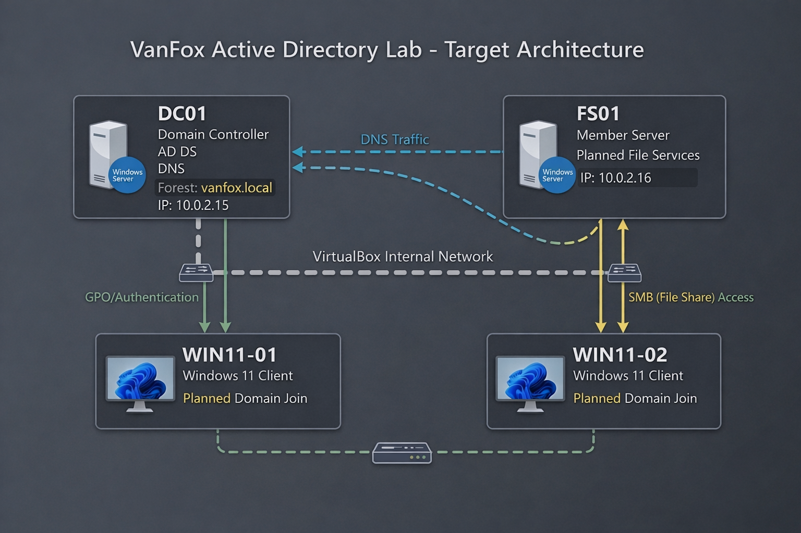

# 01 - Infrastructure

## Overview
This section documents the foundational infrastructure for the VanFox Active Directory lab. The environment was designed in VirtualBox to simulate a small business Windows domain with separated server and client roles.

The lab includes a dedicated Domain Controller, a planned File Server, and Windows 11 client systems to support identity management, access control, and endpoint administration. This phase focuses on environment structure, virtual machine planning, and the intended lab architecture.

---

## Objectives
- Establish a multi-system lab environment in VirtualBox
- Separate infrastructure by server and client role
- Prepare the environment for Active Directory, file services, and client domain join
- Create a business-style Windows lab rather than a single standalone machine

---

## Environment Summary
- **Platform:** Oracle VirtualBox
- **Lab Type:** Internal Windows domain lab
- **Primary Systems:**
  - **DC01** — Domain Controller + DNS
  - **FS01** — Planned File Server + Print Server
  - **WIN11-01** — Windows 11 client
  - **WIN11-02** — Windows 11 client

---

## Evidence

### 1) Virtual Machine Inventory

This screenshot shows the full virtual machine list created for the VanFox lab. It displays the main systems used in the project, including DC01, FS01, and the Windows 11 clients. It also includes the VM information for DC01, including resource allocation such as memory, CPU, storage, and network attachment.

**Why it matters:**  
This confirms the project is structured as a multi-system environment, which is much closer to a real business network than a single standalone server lab. It also documents that the Domain Controller was intentionally provisioned as infrastructure rather than created with only default settings.

---

### 2) Planned Lab Architecture

This diagram shows the intended architecture of the VanFox Active Directory lab, including the relationship between the Domain Controller, File Server, and Windows 11 client systems within the VirtualBox internal network.
**Planning note:** This diagram records the original design baseline. It will be replaced after all project phases are complete to reflect the final IP addressing, domain-joined clients, file services, Group Policy, and enterprise user-data services.

**Why it matters:**  
This provides a high-level view of the project design and shows how the environment is being structured to simulate a small business Windows domain.

---

## Technical Takeaways
This phase demonstrates:
- Virtual lab planning
- Environment structuring for Windows infrastructure
- Role separation between directory services, file services, and clients
- Foundational setup for enterprise-style system administration

---

## Phase Outcome
The VanFox lab environment was prepared as a structured Windows domain simulation, providing the infrastructure base required for domain services, directory management, and future policy and access-control phases.
