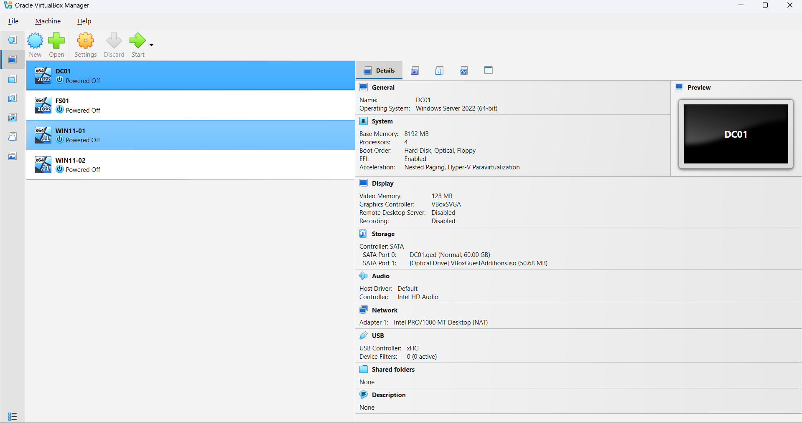

# 01 - Infrastructure

## Overview
This section documents the foundational infrastructure for the VanFox Active Directory lab. The environment was designed in VirtualBox to simulate a small business Windows domain with separated server and client roles.

The lab includes a dedicated Domain Controller, a planned File Server, and Windows 11 client systems to support identity management, access control, and endpoint administration. This phase focuses on lab planning, virtual machine layout, and environment structure.

---

## Objectives
- Establish a multi-system lab environment in VirtualBox
- Separate infrastructure by server and client role
- Prepare the environment for Active Directory, file services, and client domain join
- Create a business-style Windows lab rather than a single isolated machine setup

---

## Environment Summary
- **Platform:** Oracle VirtualBox
- **Lab Type:** Internal Windows domain lab
- **Primary Systems:**
  - **DC01** — Domain Controller + DNS
  - **FS01** — Planned File Server + Print Server
  - **WIN11-01** — Windows 11 client
  - **WIN11-02** — Windows 11 client

This aligns with the initial lab design defined for the VanFox environment. :contentReference[oaicite:1]{index=1}

---

## Evidence

### 1) Virtual Machine Inventory

This screenshot shows the full virtual machine list created for the VanFox lab. It should display the main systems used in the project, including DC01, FS01, and the Windows 11 clients. It also includes the VM configuration for DC01, including resource allocation such as memory, CPU, storage, and network attachment.

**Why it matters:**  
This confirms the project is structured as a multi-system environment, which is much closer to a real business network than a single standalone server lab. Additionally, this documents that the Domain Controller was intentionally provisioned as infrastructure, not simply created with default settings. It helps show planning, system allocation, and environment preparation.
---

### 2) Lab Topology or Network View

This screenshot or diagram shows how the systems are intended to relate to one another inside the VirtualBox lab environment.

**Why it matters:**  
This gives the reviewer a quick understanding of the architecture before they move into the implementation phases.

---

## Technical Takeaways
This phase demonstrates:
- Virtual lab planning
- Environment structuring for Windows infrastructure
- Role separation between domain services, file services, and clients
- Foundational setup for enterprise-style system administration

---

## Phase Outcome
The VanFox lab environment was prepared as a structured Windows domain simulation, providing the infrastructure base required for domain services, directory management, and future policy and access-control phases.
