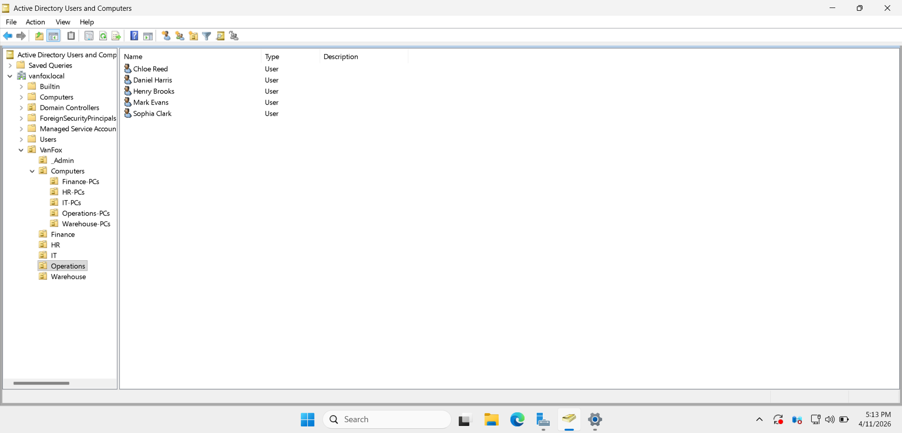

# 02 - Domain Controller Promotion

## Overview
This section documents the deployment and promotion of DC01 as the primary Domain Controller for the VanFox lab environment.

DC01 was configured to host Active Directory Domain Services and DNS, forming the identity and name-resolution backbone of the domain. This phase establishes the centralized authentication infrastructure required for organizational units, security groups, user accounts, client joins, and future Group Policy deployment.

---

## Objectives
- Configure the main Windows Server system as DC01
- Install Active Directory Domain Services
- Install DNS Server
- Promote the server to a Domain Controller
- Create the new forest for the VanFox lab domain

---

## Domain Configuration
- **Server Name:** `DC01`
- **Core Roles:** Active Directory Domain Services, DNS
- **Domain Name:** `vanfox.local`

These elements align with the planned VanFox lab design. :contentReference[oaicite:0]{index=0}

---

## Evidence

### 1) DC01 System Name and Domain Membership

This screenshot shows the Server Manager **Local Server** view for DC01, including the configured hostname and domain membership.

**Why it matters:**  
This confirms that the server is correctly identified as DC01 and is associated with the `vanfox.local` domain environment.

---

### 2) AD DS and DNS Role Installation

This screenshot shows that the required server roles, **Active Directory Domain Services** and **DNS Server**, are installed on DC01.

**Why it matters:**  
These roles are required for domain controller functionality, enabling centralized directory services and name resolution within the domain.

---

### 3) vanfox.local Domain in Active Directory Users and Computers

This screenshot shows **Active Directory Users and Computers** with the `vanfox.local` domain visible in the directory tree.

**Why it matters:**  
This is the core evidence that the domain was successfully created and that Active Directory is functioning in the environment.

---

### 4) Post-Promotion ADUC Validation

This screenshot shows a broader post-promotion view in **Active Directory Users and Computers**, confirming that DC01 is operating as a domain controller and that the domain structure is available for administration.

**Why it matters:**  
This validates that promotion completed successfully and that directory services are active and manageable.

---

## Technical Takeaways
This phase demonstrates:
- Windows Server role deployment
- Active Directory Domain Services installation
- DNS integration with Active Directory
- Domain Controller promotion
- Centralized domain identity infrastructure

---

## Phase Outcome
DC01 was established as the primary Domain Controller for the VanFox environment, providing the domain foundation needed for structured identity and administrative management throughout the rest of the project.
