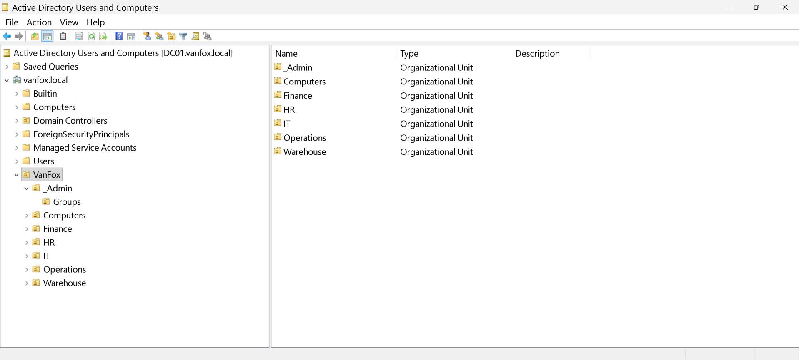

# 03 - OU Design

## Overview
This section documents the Organizational Unit structure created inside the VanFox domain.

The OU design was built to reflect a business-oriented directory layout with separate containers for departments, administration, and computer objects. This structure prepares the environment for cleaner administration, future Group Policy targeting, and scalable directory management.

---

## Objectives
- Create a root OU for the VanFox organization
- Organize departments into separate sub-OUs
- Separate computer objects from user objects
- Prepare the directory for structured administration and policy application

---

## OU Structure
The VanFox directory structure includes:

- `VanFox`
  - `_Admin`
  - `IT`
  - `HR`
  - `Finance`
  - `Operations`
  - `Warehouse`
  - `Computers`
    - `IT-PCs`
    - `HR-PCs`
    - `Finance-PCs`
    - `Operations-PCs`
    - `Warehouse-PCs`

This OU hierarchy matches the planned structure in the lab guide. :contentReference[oaicite:3]{index=3}

---

## Evidence

### 1) Root OU Structure

This screenshot shows the top-level `VanFox` Organizational Unit and the main department and administration containers created beneath it.

**Why it matters:**  
This confirms that the directory was structured intentionally instead of using a flat or default object layout.

---

### 2) Department OUs

This screenshot highlights the business-aligned department OUs such as IT, HR, Finance, Operations, and Warehouse.

**Why it matters:**  
Separating departments into individual OUs supports cleaner identity organization, easier delegation, and more precise policy targeting later.

---

### 3) Computer OU Structure

This screenshot shows the `Computers` OU and its child OUs for department-specific workstations.

**Why it matters:**  
This demonstrates forward planning for endpoint management, client placement, and future GPO application by department or workstation type.

---

## Technical Takeaways
This phase demonstrates:
- Logical Active Directory design
- Department-based object organization
- Separation of administrative and operational objects
- Policy-ready OU hierarchy for future GPO scoping

---

## Phase Outcome
The VanFox domain was organized into a structured OU hierarchy that supports scalable directory administration and prepares the environment for later endpoint placement, user management, and Group Policy deployment.
