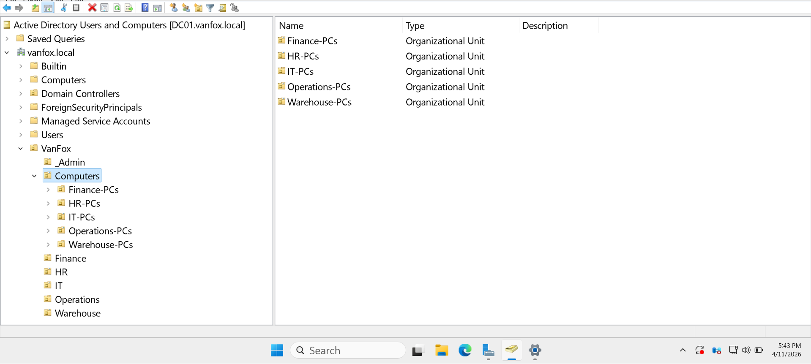

# 03 - OU Design

## Overview
This section documents the Organizational Unit structure implemented inside the `vanfox.local` domain.

The directory was organized around administrative, departmental, security-group, and computer-management requirements. This structure supports cleaner object administration, controlled Group Policy targeting, and future expansion of the VanFox environment.

---

## Objectives
- Create a root OU for the VanFox organization
- Separate user accounts by business department
- Centralize security groups inside a dedicated administrative OU
- Separate computer objects by department
- Prepare the directory for Group Policy targeting and scalable administration

---

## OU Structure
The implemented directory structure includes:

- `VanFox`
  - `_Admin`
    - `Groups`
  - `IT`
  - `HR`
  - `Finance`
  - `Operations`
  - `Warehouse`
  - `Computers`
    - `IT-PCs`
    - `HR-PCs`
    - `Finance-PCs`
    - `Operations-PCs`
    - `Warehouse-PCs`

The `_Admin\Groups` OU provides a centralized location for security groups while keeping them separate from departmental user accounts.

---

## Evidence

### 1) Root OU Structure

This screenshot shows the top-level `VanFox` OU, departmental OUs, the computer-management structure, and the dedicated `_Admin\Groups` administrative container.

**Why it matters:**  
This confirms that the directory uses an intentional business-aligned structure instead of relying on the default Active Directory containers or a flat directory layout.

---

### 2) Computer OU Structure

This screenshot shows the `Computers` OU and its child OUs for department-specific workstations:

- `IT-PCs`
- `HR-PCs`
- `Finance-PCs`
- `Operations-PCs`
- `Warehouse-PCs`

**Why it matters:**  
Department-specific computer OUs support organized device placement, targeted Group Policy application, and easier endpoint administration.

---

## Technical Takeaways
This phase demonstrates:

- Logical Active Directory design
- Department-based directory organization
- Separation of users, groups, and computer objects
- Centralized security-group administration
- Policy-ready OU hierarchy
- Scalable enterprise-style directory planning

---

## Phase Outcome
The VanFox domain was organized into a structured OU hierarchy that supports scalable administration, departmental user management, centralized security groups, computer placement, and future Group Policy deployment.
