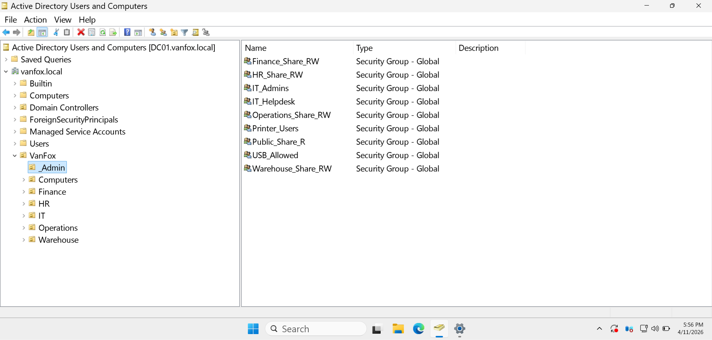

# 04 - Security Groups

## Overview
This section documents the security group structure created within the VanFox domain.

The group design separates department-based resource access from role-based administrative functions. This supports cleaner permission assignment, stronger access-control planning, and easier administration as the environment expands into file shares, printers, USB restrictions, and delegated support roles.

---

## Objectives
- Create department-based groups for shared resource access
- Create role-based groups for administrative and operational control
- Prepare the environment for future file permissions and policy targeting
- Separate resource access groups from privileged or support-related groups

---

## Security Group Structure

### Department Share Groups
- `HR_Share_RW`
- `Finance_Share_RW`
- `Operations_Share_RW`
- `Warehouse_Share_RW`
- `Public_Share_R`

### Role-Based Groups
- `IT_Admins`
- `IT_Helpdesk`
- `USB_Allowed`
- `Printer_Users`

---

## Evidence

### 1) Security Group Inventory

This screenshot shows the security groups created in the administrative area of the domain, including both department-based share groups and role-based groups.

**Why it matters:**  
This confirms that access is being designed through reusable security groups rather than being assigned directly to individual users.

---

### 2) Department Share Group Example

This screenshot shows the properties of a department-based share group, such as `HR_Share_RW` or `Finance_Share_RW`.

**Why it matters:**  
This demonstrates how department resource access is being structured around group-based assignment, which is cleaner and more scalable than user-by-user permission management.

---

### 3) Role-Based Group Example

This screenshot shows the properties of a role-based group, such as `IT_Admins` or `IT_Helpdesk`.

**Why it matters:**  
This shows that the environment separates role-based administration from department share access, which supports stronger access control design.

---

## Technical Takeaways
This phase demonstrates:
- Security group planning
- Group-based access design
- Separation of resource access and role assignment
- Preparation for role-based access control
- Scalable permission management practices

---

## Phase Outcome
The VanFox environment now includes a structured security group model that supports future share permissions, delegated administration, and policy-linked access control.
