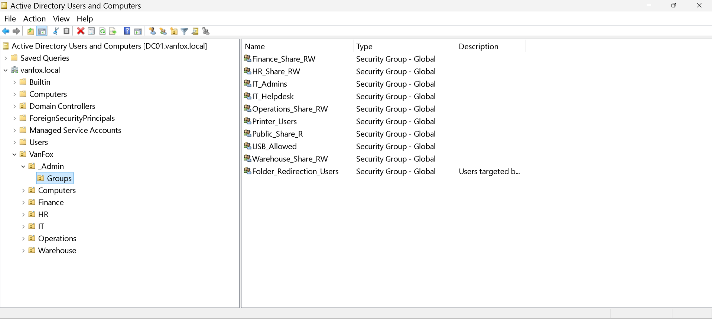
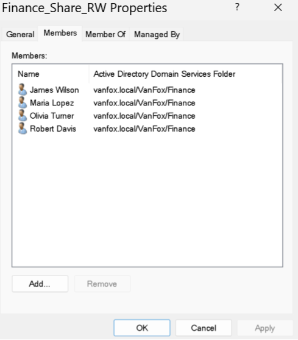
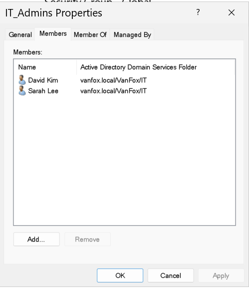

# 04 - Security Groups

## Overview
This section documents the security group structure implemented within the `vanfox.local` domain.

The groups are centrally organized inside `VanFox\_Admin\Groups` and configured as Global Security groups. The design separates department resource access, administrative roles, operational access, and Group Policy targeting.

---

## Objectives
- Centralize security groups in a dedicated OU
- Create department-based groups for shared-folder access
- Create groups for administrative and support roles
- Create policy-targeting groups for Group Policy deployment
- Assign access through group membership instead of directly to individual users

---

## Security Group Structure

### Department Resource Groups
- `HR_Share_RW`
- `Finance_Share_RW`
- `Operations_Share_RW`
- `Warehouse_Share_RW`
- `Public_Share_R`

The department groups provide read/write access to their corresponding departmental resources. `Public_Share_R` provides read-only access to the shared public resource.

### Role and Policy Groups
- `IT_Admins`
- `IT_Helpdesk`
- `Folder_Redirection_Users`
- `USB_Allowed`
- `Printer_Users`

`Folder_Redirection_Users` controls which users receive the Folder Redirection Group Policy.

---

## Evidence

### 1) Security Group Inventory

This screenshot shows the centralized `VanFox\_Admin\Groups` OU and all Global Security groups created for resource access, administrative roles, operational access, and policy targeting.

**Why it matters:**  
This confirms that access is managed through reusable security groups instead of assigning permissions directly to individual users.

---

### 2) Department Share Group Membership

This screenshot shows the members of `Finance_Share_RW`, with Finance department users assigned to the appropriate resource-access group.

**Why it matters:**  
Department permissions can be managed by changing group membership without modifying file permissions for each individual user.

---

### 3) Role-Based Group Membership

This screenshot shows the membership of `IT_Admins`, demonstrating how administrative access is separated from department resource access.

**Why it matters:**  
Dedicated role groups support controlled administrative access and clearer separation of responsibilities.

---

## Technical Takeaways
This phase demonstrates:

- Global Security group administration
- Group-based permission management
- Separation of resource access and administrative roles
- Group Policy security filtering preparation
- Role-based access control principles
- Scalable identity and access management

---

## Phase Outcome
The VanFox environment contains a centralized security-group structure actively supporting departmental file access, administrative roles, printer deployment, USB exceptions, and Folder Redirection security filtering.
