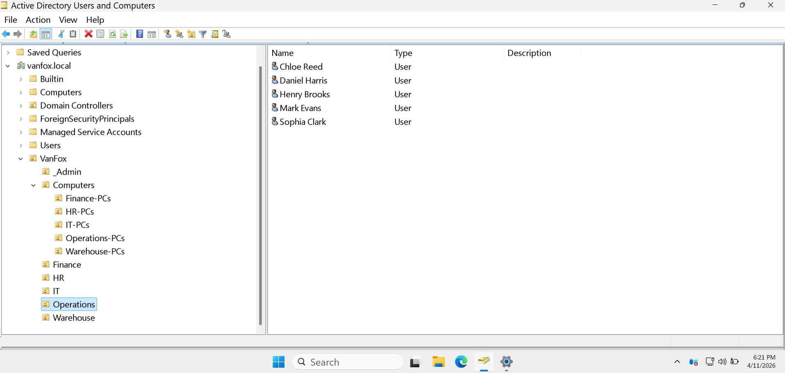
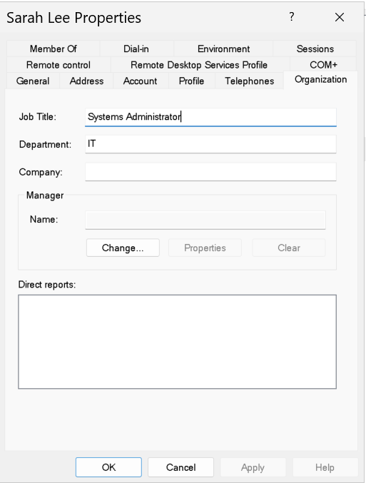
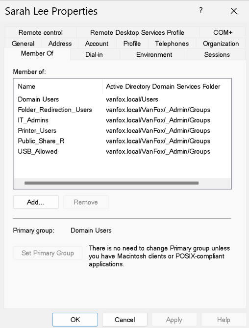

# 05 - User Provisioning

## Overview
This section documents the provisioning and organization of 20 domain user accounts inside the VanFox Active Directory environment.

Users were placed into department-specific Organizational Units and configured with consistent identity information, including display name, department, job title, and description. Access is assigned through security-group membership instead of direct user permissions.

---

## Objectives
- Create realistic domain user accounts
- Organize users into department-specific OUs
- Populate standardized identity and employment information
- Assign resource access through security groups
- Prepare users for file shares, mapped drives, printers, and Group Policy

---

## User Distribution

| Department | User Count |
|---|---:|
| IT | 5 |
| HR | 3 |
| Finance | 4 |
| Operations | 5 |
| Warehouse | 3 |
| **Total** | **20** |

Each user account includes:

- Display name
- Department
- Job title
- Description formatted as `Department - Job Title`
- Department-appropriate security-group membership

---

## Access Assignment

All 20 users were added to:

- `Public_Share_R`
- `Folder_Redirection_Users`

Department users were also assigned to their corresponding resource groups:

- HR users → `HR_Share_RW`
- Finance users → `Finance_Share_RW`
- Operations users → `Operations_Share_RW`
- Warehouse users → `Warehouse_Share_RW`

Additional administrative and operational groups were assigned according to each user’s role.

---

## Evidence

### 1) Department User Accounts

This screenshot shows the five Operations user accounts placed inside the `Operations` OU.

**Why it matters:**  
This confirms that users are stored in business-aligned OUs instead of default Active Directory containers, supporting organized administration and targeted Group Policy application.

---

### 2) Standardized User Properties

This screenshot shows Sarah Lee configured with the job title `Systems Administrator` and the department `IT`.

**Why it matters:**  
Populating organizational information creates realistic, searchable identity records and supports clearer administration, reporting, and automation.

---

### 3) Group-Based Access Assignment

This screenshot shows Sarah Lee’s membership in:

- `Folder_Redirection_Users`
- `IT_Admins`
- `Printer_Users`
- `Public_Share_R`
- `USB_Allowed`

**Why it matters:**  
This demonstrates that access and policy targeting are assigned through reusable security groups rather than direct permissions on individual accounts.

---

## Technical Takeaways
This phase demonstrates:

- Active Directory user provisioning
- Department-based identity organization
- Standardized account attributes
- Security-group membership management
- Group-based resource access
- Group Policy security-filtering preparation
- Scalable identity and access administration

---

## Phase Outcome
The VanFox domain now contains 20 structured user accounts organized by department and configured with realistic employment information. Users are prepared for departmental file access, public resources, Folder Redirection, mapped drives, printer access, and future Group Policy deployment.
