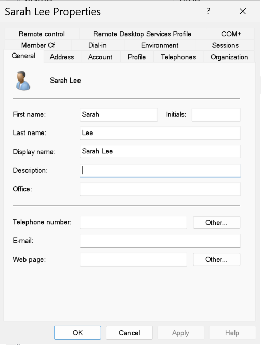

# 05 - User Provisioning

## Overview
This section documents the creation of user accounts within the VanFox Active Directory environment.

User objects were provisioned across multiple department-specific Organizational Units to simulate a realistic business directory. The structure supports cleaner administration, future access assignment through security groups, and business-aligned identity organization.

---

## Objectives
- Create domain user accounts across department OUs
- Organize users by department rather than storing them in default containers
- Maintain consistent naming and account structure
- Prepare accounts for group-based permissions, mapped drives, printer access, and policy targeting

---

## User Scope
The current user structure includes accounts distributed across the following departments:

- **IT**
- **HR**
- **Finance**
- **Operations**
- **Warehouse**

---

## Evidence

### 1) Department User Accounts in OU

This screenshot shows user accounts created inside a department-specific Organizational Unit.

**Why it matters:**  
This confirms that user objects were placed into the correct business-aligned OUs rather than stored in default containers, supporting cleaner administration and future policy targeting.

---

### 2) Sample User Properties

This screenshot shows the properties of a sample user account after creation.

**Why it matters:**  
This provides evidence that the account was provisioned as a managed Active Directory user object with structured identity information inside the domain.

---

### 3) Sample User Group Membership

This screenshot shows the **Member Of** tab for a sample user account.

**Why it matters:**  
This demonstrates how user provisioning connects to the access-control model by assigning users to security groups rather than managing permissions directly on individual accounts.

---

## Technical Takeaways
This phase demonstrates:
- Active Directory user provisioning
- Department-based identity organization
- Structured user placement in Organizational Units
- Alignment between user accounts and security groups
- Preparation for role-based access control and future policy targeting

---

## Phase Outcome
The VanFox domain now includes a realistic user base organized by department and prepared for group-based access control, future share permissions, and endpoint policy application.
