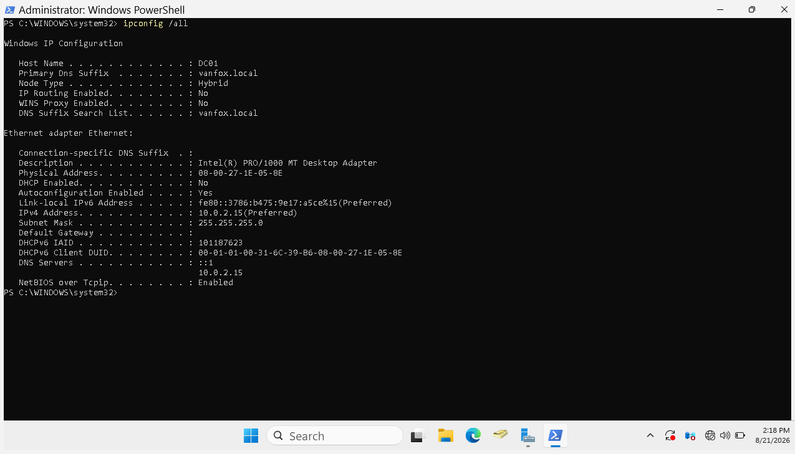
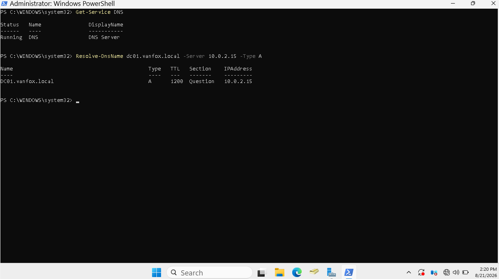
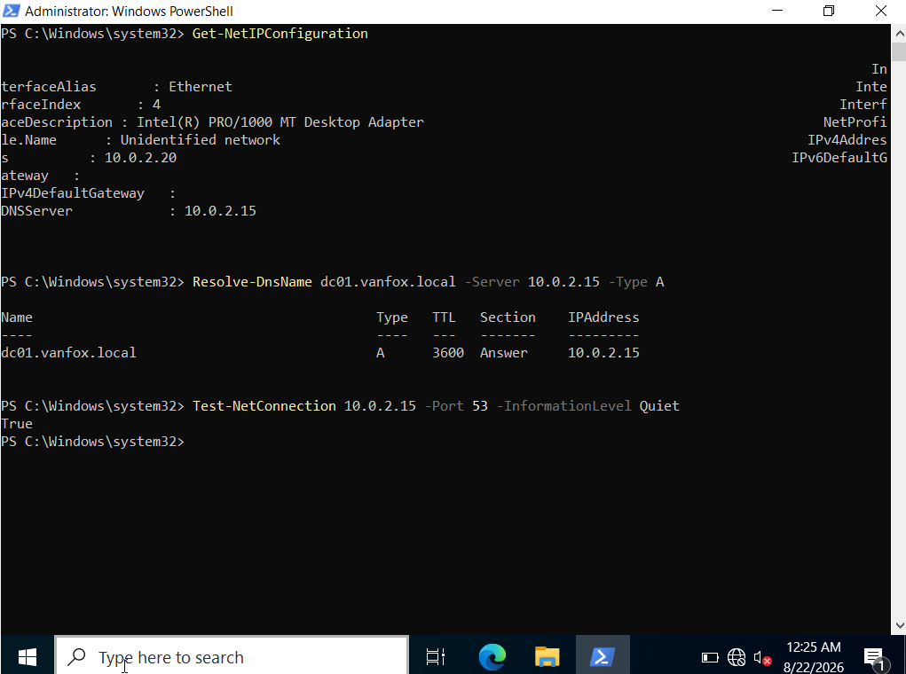
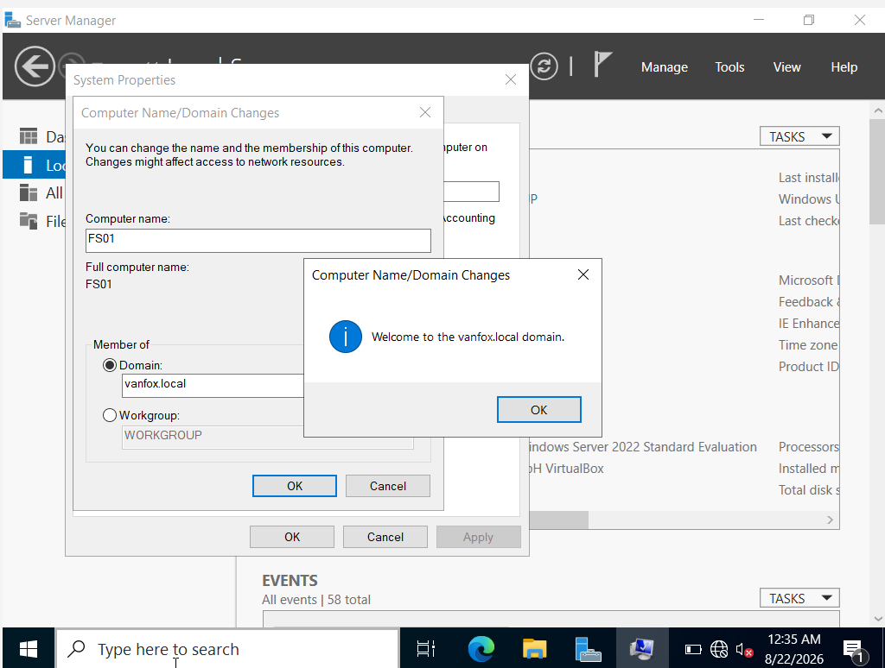
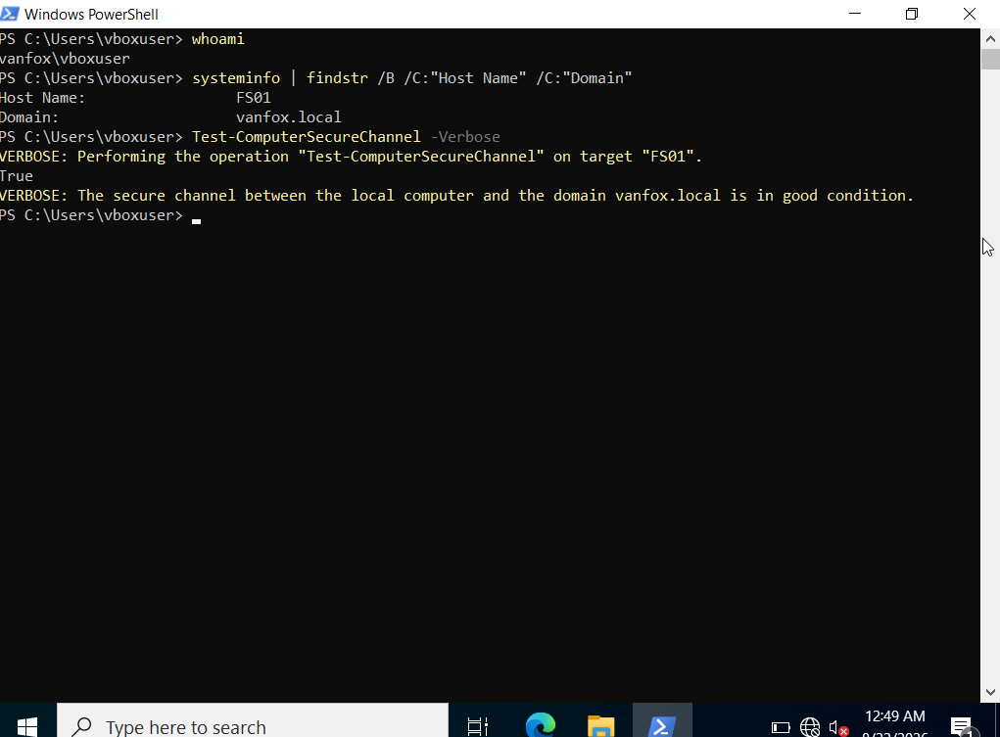
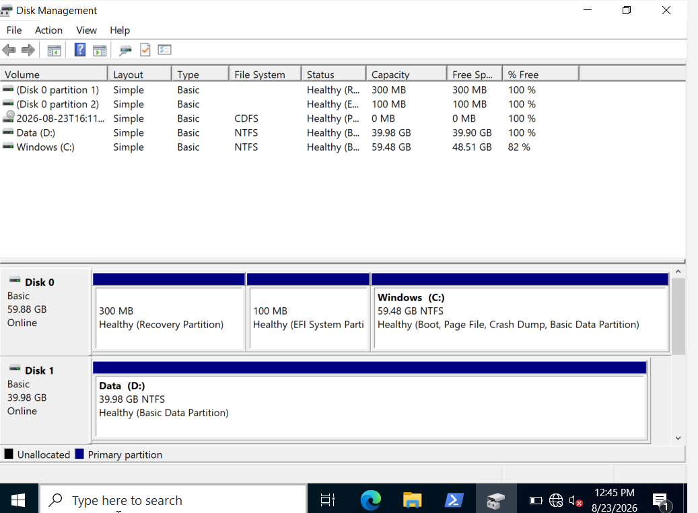
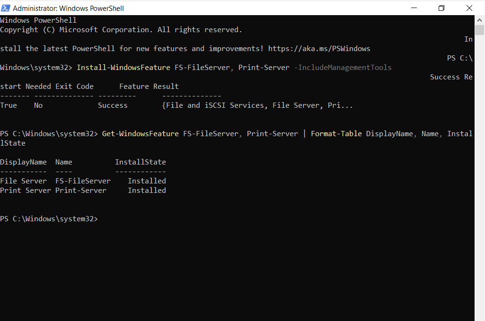
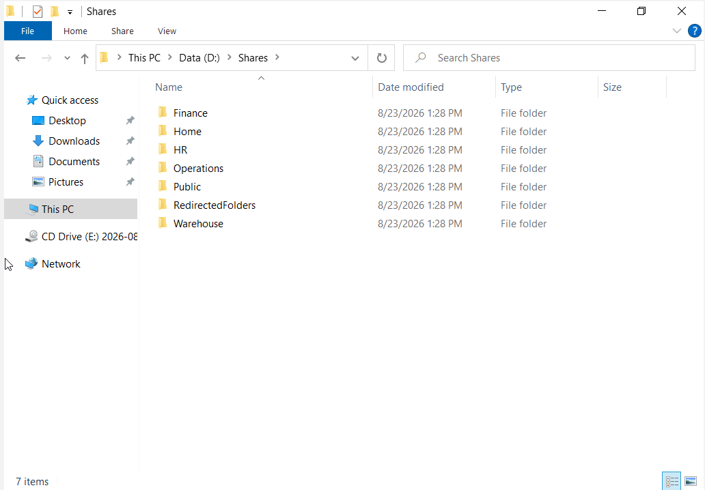
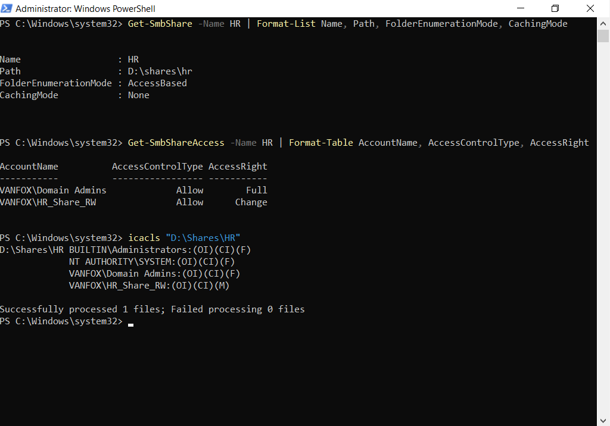
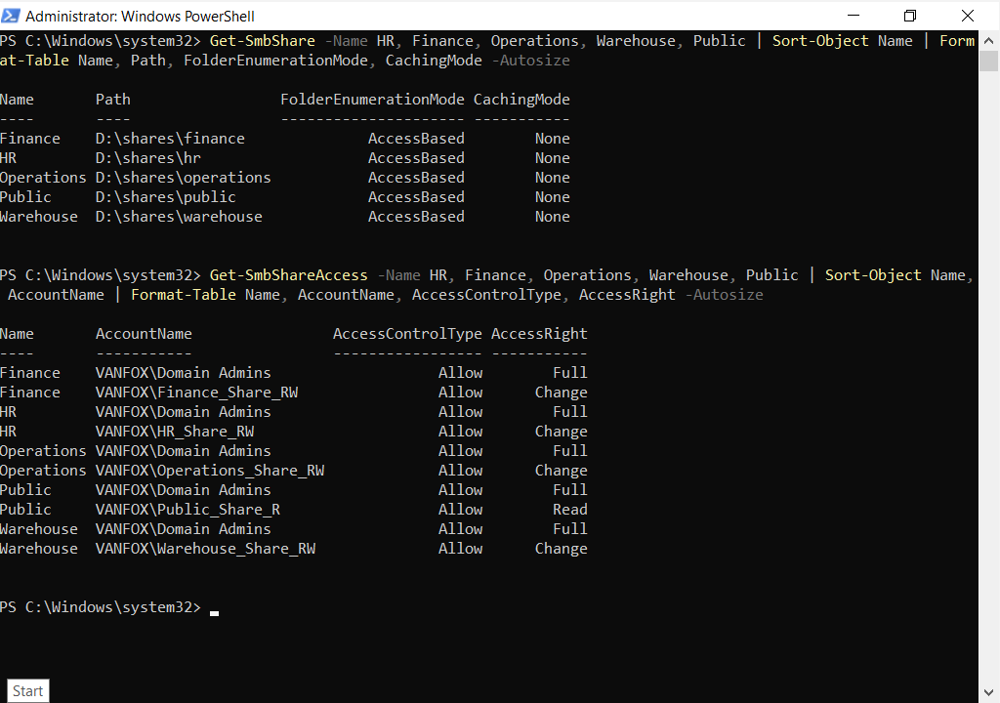

# VanFox File Server Deployment

## Overview

This phase documents the deployment of **FS01**, a domain-joined Windows Server configured to provide centralized file and print services for the `vanfox.local` Active Directory environment.

The implementation includes dedicated data storage, departmental SMB shares, Active Directory security-group integration, access-based enumeration, and separate read/write and read-only permission models.

---

## Server Configuration

| Setting | Configuration |
|---|---|
| Server name | `FS01` |
| Domain | `vanfox.local` |
| IPv4 address | `10.0.2.20/24` |
| DNS server | `10.0.2.15` (`DC01`) |
| Data volume | `D:` — NTFS, labeled `Data` |
| Installed roles | File Server and Print Server |

---

## Network and DNS Preparation

Before joining FS01 to the domain, DC01's static network configuration and DNS service were verified. FS01 was then assigned a static address and configured to use DC01 as its only DNS server.

---

## Domain Integration

FS01 was successfully joined to `vanfox.local`. Domain membership and the workstation trust relationship were validated after restart.

---

## Storage and Server Roles

A dedicated 40 GB virtual disk was attached to FS01, initialized using GPT, formatted with NTFS, assigned drive letter `D:`, and labeled `Data`. Separating shared data from the operating-system volume provides a cleaner and more manageable server design.

The File Server and Print Server roles, including their management tools, were installed and verified through PowerShell.

---

## Share Folder Structure

The following folder structure was created under `D:\Shares`:

- `Finance`
- `Home`
- `HR`
- `Operations`
- `Public`
- `RedirectedFolders`
- `Warehouse`

---

## Departmental Shares and Access Control

Departmental shares were secured with Active Directory groups instead of assigning permissions directly to individual users.

| SMB share | Security group | Share permission | NTFS permission |
|---|---|---|---|
| `HR` | `HR_Share_RW` | Change | Modify |
| `Finance` | `Finance_Share_RW` | Change | Modify |
| `Operations` | `Operations_Share_RW` | Change | Modify |
| `Warehouse` | `Warehouse_Share_RW` | Change | Modify |
| `Public` | `Public_Share_R` | Read | Read & Execute |

Additional controls include:

- `Domain Admins` retain Full Control for administration.
- `SYSTEM` and local Administrators retain full NTFS control.
- Broad `Everyone` permissions were removed.
- Access-Based Enumeration hides folders a user cannot access.
- Offline caching was disabled for the departmental shares.

The HR share was used as a detailed representative validation of both SMB and NTFS permissions.

The final summary verifies the configuration of all five departmental shares, including read-only access to the Public share.

---

## Troubleshooting and Resolution

During deployment, DNS queries from FS01 initially timed out because DC01 was powered off. Starting DC01 restored DNS resolution and allowed domain services to be validated successfully.

Role installation also initially failed when attempted from a standard domain-user session. The task was repeated using an authorized administrator account, demonstrating the distinction between standard-user and administrative privileges.

---

## Validation Results

- FS01 resolves DC01 through the internal DNS server.
- FS01 is joined to `vanfox.local` with a healthy trust relationship.
- The dedicated data volume is online and formatted with NTFS.
- File Server and Print Server roles are installed.
- Departmental shares use group-based permissions.
- Department shares provide Change/Modify access to their assigned groups.
- The Public share provides read-only access.
- Access-Based Enumeration is enabled and offline caching is disabled.

---

## Skills Demonstrated

- Windows Server deployment and administration
- Static IPv4 and DNS configuration
- Active Directory domain integration
- Virtual disk provisioning and NTFS volume management
- Windows file and print role installation
- SMB share administration
- Share and NTFS permission design
- Security-group-based access control
- PowerShell configuration and validation
- Technical troubleshooting and documentation
