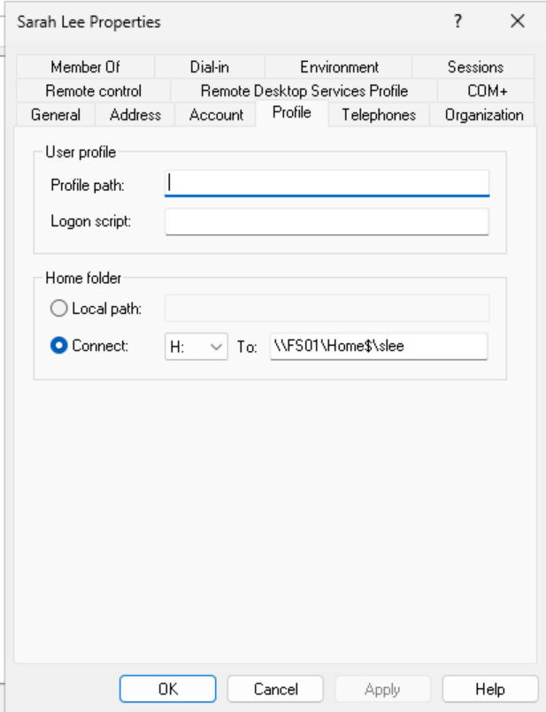
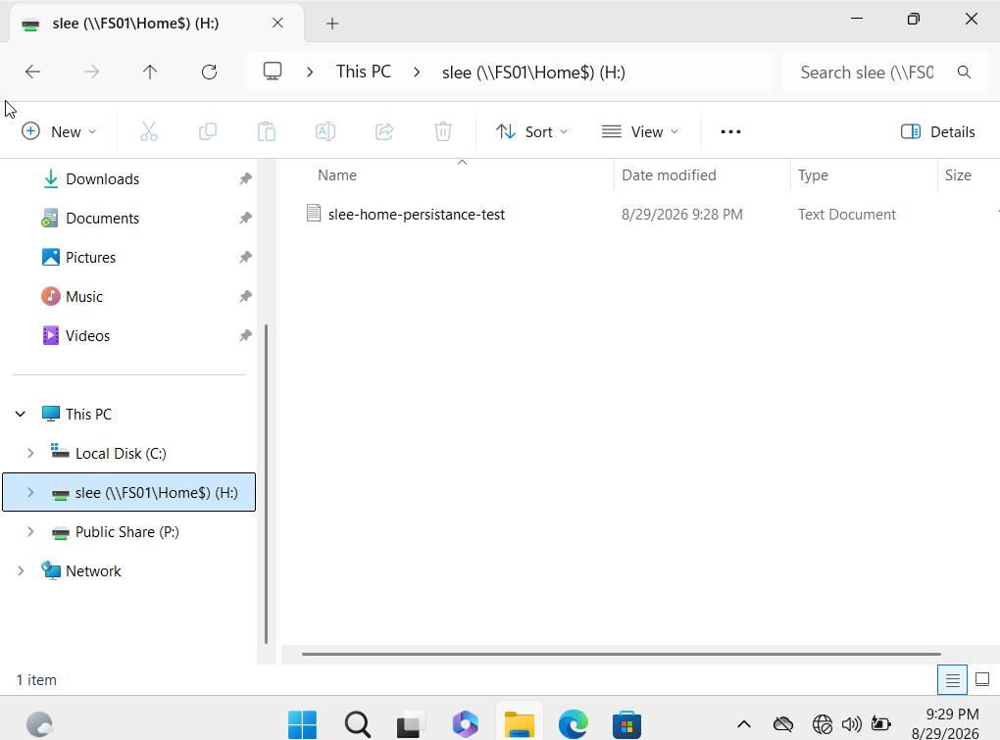
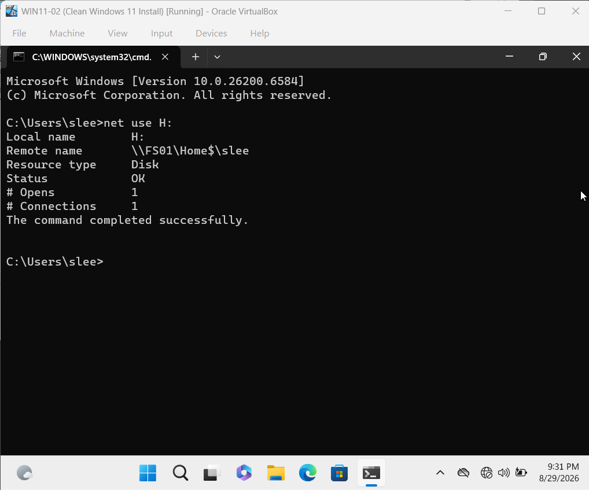
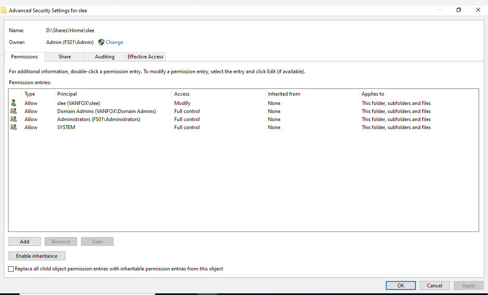
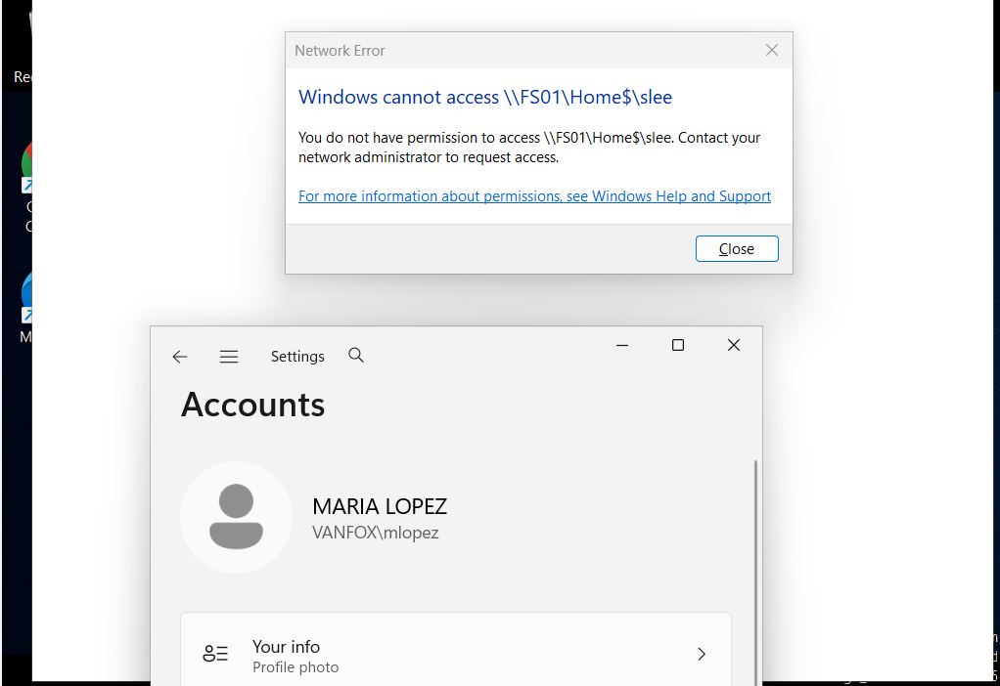

# 07 - Personal Home Folders

## Overview

This phase documents the deployment and validation of private, server-hosted Home Folders for VanFox domain users. Each user receives a dedicated `H:` drive mapped to a hidden share on **FS01**, providing centralized storage while preventing standard users from accessing one another's files.

The implementation uses Active Directory user-profile settings, SMB sharing, and per-user NTFS permissions to provide persistent, identity-based access.

---

## Objectives

- Provide each domain user with private server-hosted storage
- Map the personal folder automatically as drive `H:`
- Keep user data available after signing out and back in
- Apply least-privilege NTFS permissions
- Prevent cross-user access to personal folders

---

## Home Folder Design

| Setting | Configuration |
|---|---|
| Server root | `D:\Shares\Home` |
| Hidden share | `\\FS01\Home$` |
| User path | `\\FS01\Home$\%username%` |
| Drive letter | `H:` |
| User permission | Modify |
| Administrative access | Domain Admins, FS01 Administrators, and SYSTEM: Full Control |

The dollar sign in `Home$` makes the SMB share hidden from ordinary network browsing. Users reach their assigned folders through the mapped drive or their exact UNC path.

---

## Implementation

1. A hidden SMB share named `Home$` was created on FS01.
2. A separate subfolder was created for each domain username.
3. Inherited NTFS permissions were disabled on the individual user folders.
4. Each user received Modify access to only their own folder.
5. Domain Admins, local FS01 Administrators, and SYSTEM retained Full Control.
6. Each user's Active Directory profile was configured to connect drive `H:` to their personal UNC path.

---

## Evidence

### 1) Active Directory Home Folder Assignment

Sarah Lee's Active Directory profile connects drive `H:` to `\\FS01\Home$\slee`.

**Why it matters:** This demonstrates centralized drive assignment through Active Directory rather than requiring users to map their folders manually.

---

### 2) Persistent Personal Storage

The `H:` drive appears in File Explorer and retains `slee-home-persistence-test.txt` after Sarah signs out and signs back in.

**Why it matters:** This confirms that the data is stored centrally on FS01 instead of only inside the local Windows profile.

---

### 3) UNC Mapping Validation

The `net use H:` result shows that drive `H:` is connected to `\\FS01\Home$\slee` with status `OK`.

**Why it matters:** This provides command-line verification of the active drive mapping and its exact server path.

---

### 4) Least-Privilege NTFS Permissions

The `slee` folder grants Sarah Modify access while Domain Admins, local FS01 Administrators, and SYSTEM retain Full Control. The permission entries are explicitly assigned rather than inherited from the parent folder.

**Why it matters:** This permission model allows the user to manage personal files while preserving administrative and system access without granting access to unrelated users.

---

### 5) Cross-User Access Denied

While signed in as `VANFOX\mlopez`, Windows denies access to `\\FS01\Home$\slee`.

**Why it matters:** This negative test proves that knowing another user's UNC path does not bypass the folder's NTFS security.

---

## Validation Results

- Sarah Lee receives the `H:` drive automatically.
- The drive maps to the correct FS01 UNC path.
- Files remain available after a new sign-in.
- Sarah Lee has Modify permission to her own folder.
- Required administrative and SYSTEM access is retained.
- Maria Lopez cannot open Sarah Lee's folder.

---

## Skills Demonstrated

- Active Directory user-profile administration
- Windows Home Folder deployment
- SMB hidden-share configuration
- NTFS permission design
- Least-privilege access control
- Mapped-drive validation
- Positive and negative access testing
- Windows client and file-server troubleshooting

---

## Phase Outcome

VanFox users now have private, persistent Home Folders hosted on FS01 and automatically presented as drive `H:`. Representative testing confirmed the correct mapping, retained data, least-privilege permissions, and denial of unauthorized cross-user access.
