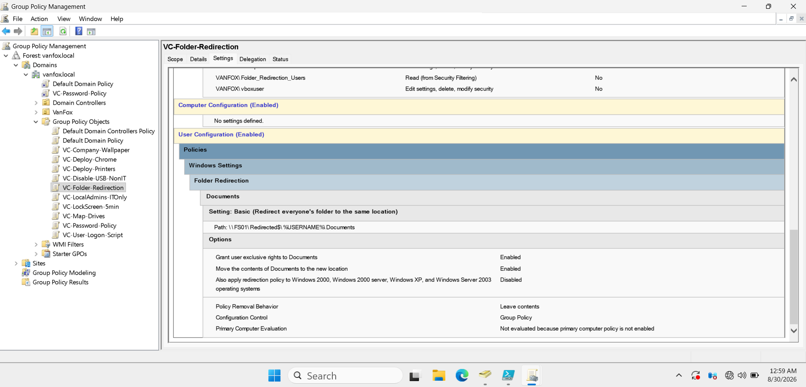
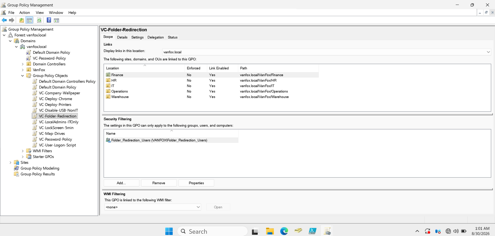
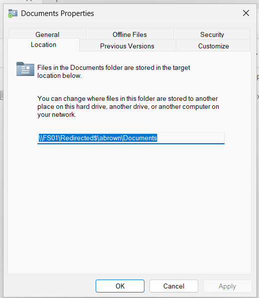
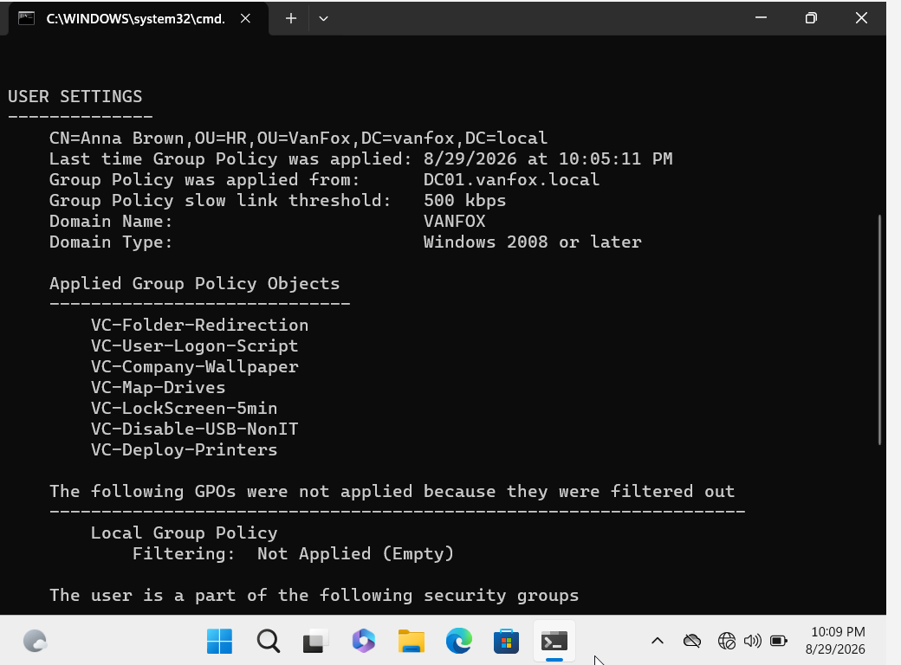
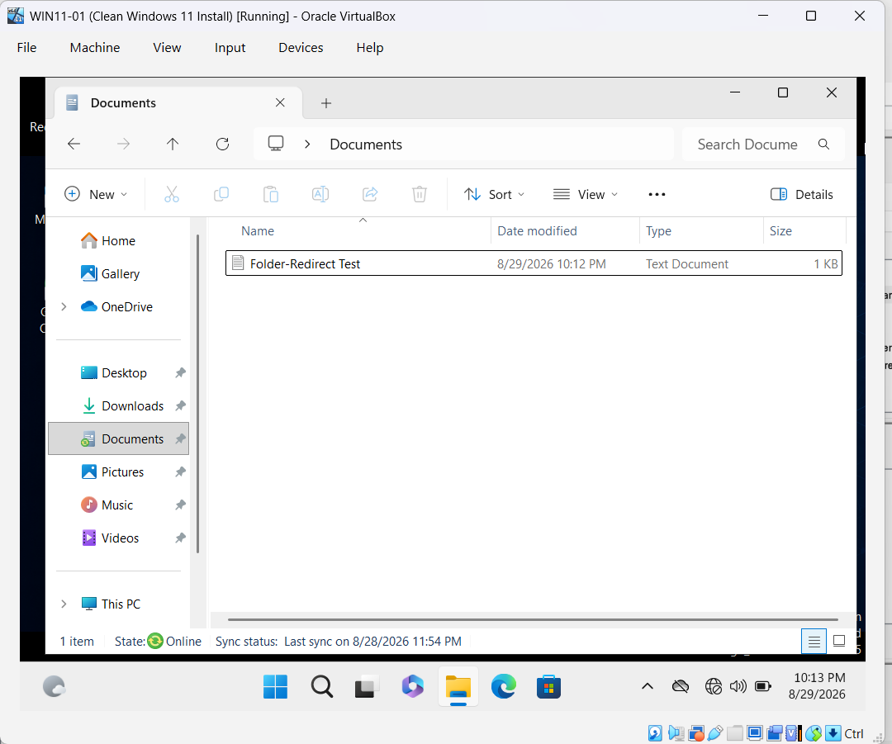
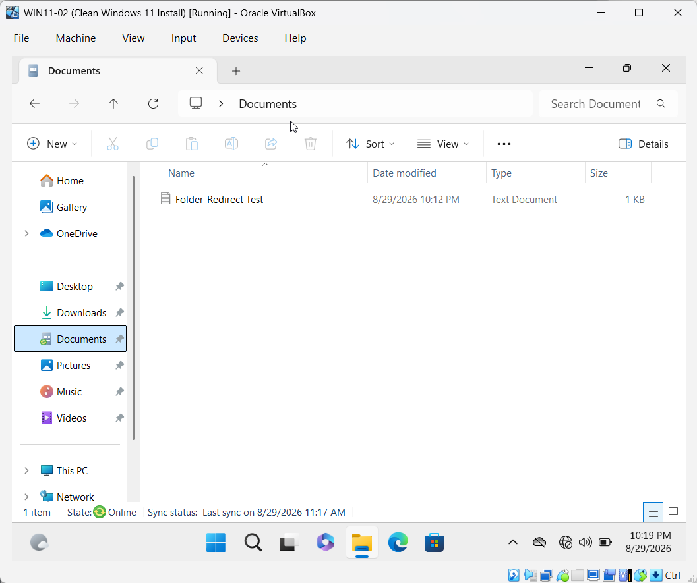

# 08 - Folder Redirection

## Overview

This phase documents the configuration and validation of Documents Folder Redirection in the VanFox Active Directory environment.

The `VC-Folder-Redirection` Group Policy Object redirects each authorized user's Documents folder from the local Windows profile to a private folder hosted on **FS01**. Users continue accessing Documents normally, while their files are centrally stored and available from multiple domain-joined computers.

---

## Objectives

- Store user Documents folders centrally on FS01
- Apply Folder Redirection through Group Policy
- Create a separate redirected folder for each user
- Restrict the policy to authorized department users
- Preserve the familiar Windows Documents experience
- Confirm that user files follow the user between domain computers

---

## Folder Redirection Design

| Setting | Configuration |
|---|---|
| Server root | `D:\Shares\RedirectedFolders` |
| Hidden share | `\\FS01\Redirected$` |
| Group Policy Object | `VC-Folder-Redirection` |
| Redirected folder | Documents |
| Configuration method | Basic |
| Target path | `\\FS01\Redirected$\%USERNAME%\Documents` |
| Security filtering | `Folder_Redirection_Users` |
| Policy removal behavior | Leave contents in the redirected location |

The policy creates a separate Documents folder for each user beneath the hidden `Redirected$` share.

---

## Policy Configuration

The Folder Redirection policy includes the following options:

- Redirect everyone’s Documents folder to the same root location
- Create an individual folder based on the username
- Grant the user exclusive rights to Documents
- Move existing Documents contents to the redirected location
- Leave the redirected folder in place if the policy is removed

The GPO is linked to the following department user OUs:

- Finance
- HR
- IT
- Operations
- Warehouse

Security filtering limits application to members of `Folder_Redirection_Users`.

---

## Implementation

1. The hidden `Redirected$` SMB share was created on FS01.
2. The `VC-Folder-Redirection` GPO was created in Group Policy Management.
3. Documents Folder Redirection was configured using the Basic method.
4. The root path was set to `\\FS01\Redirected$`.
5. Exclusive user rights and content movement were enabled.
6. The GPO was linked to all five department user OUs.
7. Security filtering was configured for `Folder_Redirection_Users`.
8. Group Policy was refreshed on the Windows 11 clients.
9. The redirected location and multi-computer file availability were validated.

---

## Evidence

### 1) Folder Redirection GPO Settings

The GPO report shows Documents configured with the Basic redirection method and the path `\\FS01\Redirected$\%USERNAME%\Documents`.

The report also confirms that exclusive rights and content movement are enabled and that redirected contents remain in place if the policy is removed.

**Why it matters:** This proves that the redirection behavior is centrally configured and consistently delivered through Group Policy.

---

### 2) GPO Links and Security Filtering

The Scope tab shows that `VC-Folder-Redirection` is linked to the Finance, HR, IT, Operations, and Warehouse user OUs.

Security Filtering contains `VANFOX\Folder_Redirection_Users`.

**Why it matters:** OU links determine where the policy is available, while security filtering controls which users are authorized to apply it.

---

### 3) Redirected Documents Location

Anna Brown’s Documents properties show the network location `\\FS01\Redirected$\abrown\Documents`.

**Why it matters:** This confirms that Documents no longer points to the local `C:` drive and is instead stored centrally on FS01.

---

### 4) Group Policy Application

The `gpresult` output identifies Anna Brown in the HR OU and lists `VC-Folder-Redirection` under Applied Group Policy Objects.

**Why it matters:** This proves that the expected user received the GPO from the domain rather than the redirected location being configured manually.

---

### 5) Redirected File on WIN11-01

While signed in as Anna Brown on WIN11-01, the `Folder-Redirect Test` text document is visible inside Documents.

**Why it matters:** This establishes the original client and file used for multi-computer validation.

---

### 6) Same File Available on WIN11-02

After Anna Brown signed in on WIN11-02, the same `Folder-Redirect Test` document appeared with the matching modification time and file size.

**Why it matters:** This demonstrates that the Documents data is stored on FS01 and follows the user between domain-joined computers.

---

## Validation Results

- `VC-Folder-Redirection` contains the correct Documents settings.
- The GPO is linked to all five department user OUs.
- Security filtering targets `Folder_Redirection_Users`.
- Anna Brown receives the policy successfully.
- Her Documents location points to FS01.
- A file created on WIN11-01 is available on WIN11-02.
- The file retains the same name, modification time, and size on both clients.

---

## Skills Demonstrated

- Group Policy Object creation and configuration
- User-based Group Policy deployment
- Folder Redirection administration
- OU-based policy linking
- Security filtering
- Centralized user-data management
- Group Policy validation with `gpresult`
- Multi-client testing
- Windows file-server integration
- Technical documentation

---

## Phase Outcome

The VanFox environment now provides centralized Documents storage through Group Policy Folder Redirection. Authorized users receive private redirected folders on FS01, and representative testing with Anna Brown confirms that user data remains available across both Windows 11 domain clients.
