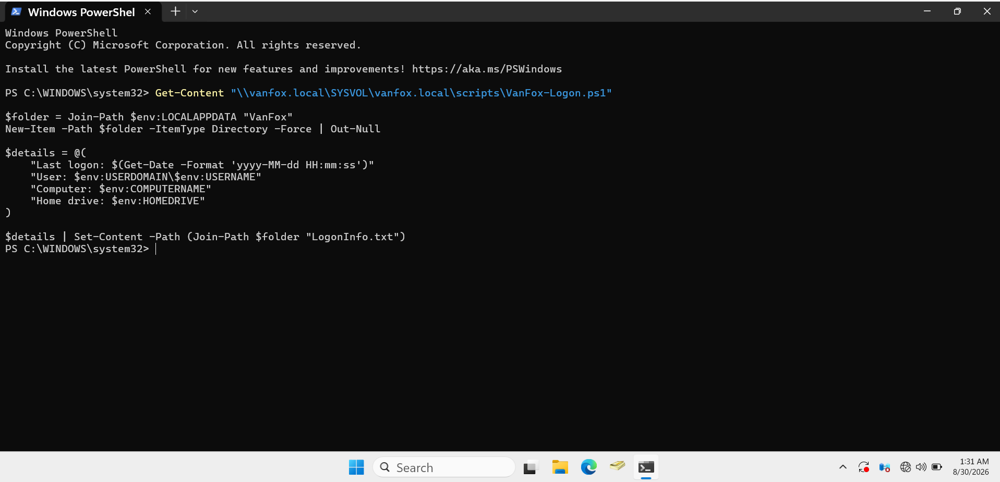
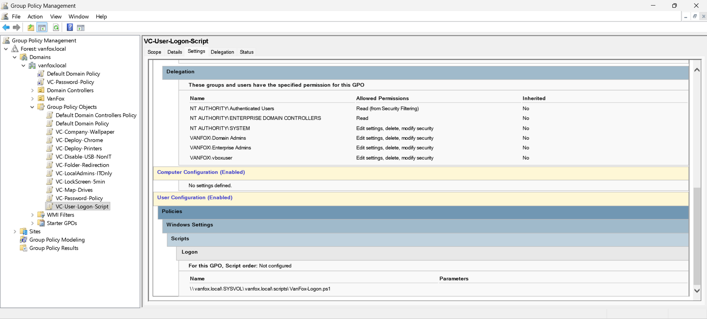
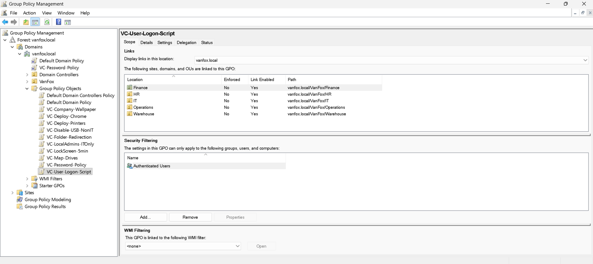
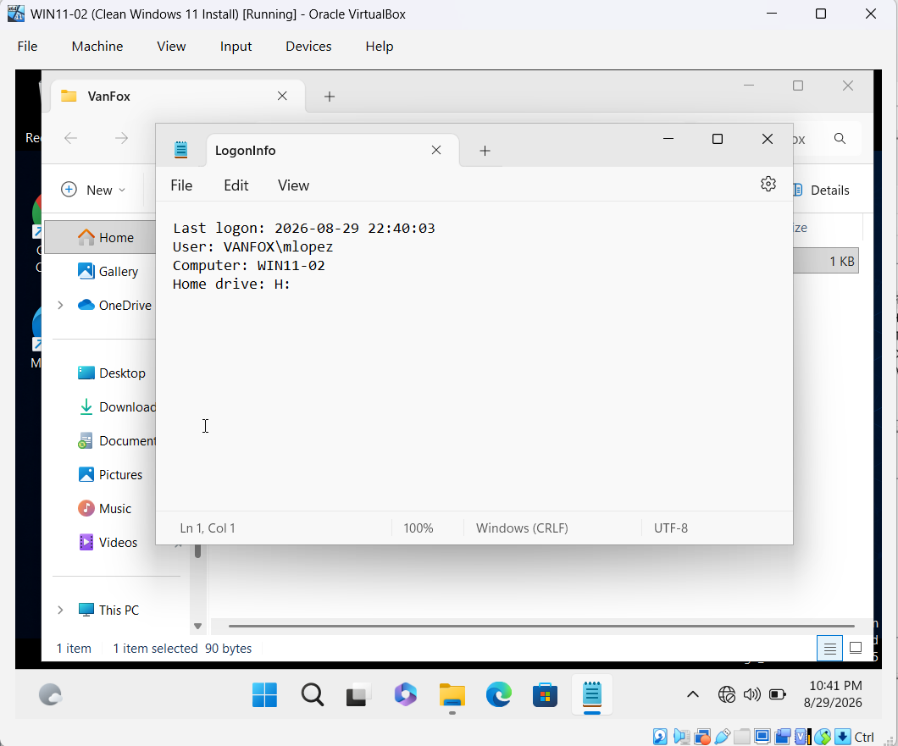
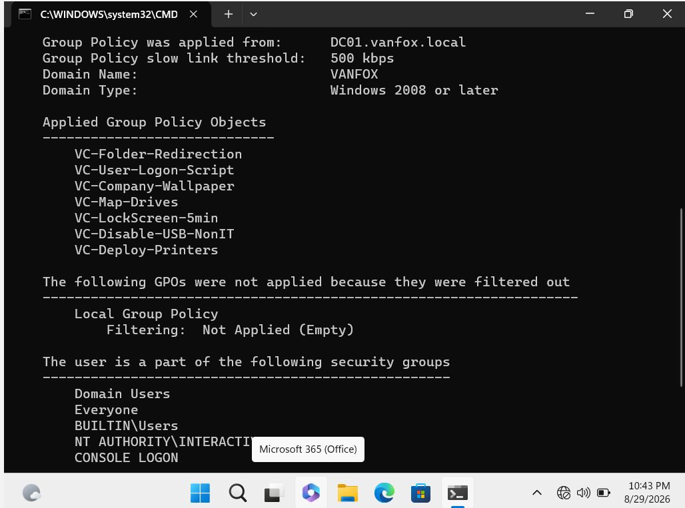

# 09 - PowerShell Logon Script

## Overview

This phase documents the deployment and validation of a PowerShell logon script in the VanFox Active Directory environment.

The `VC-User-Logon-Script` Group Policy Object runs `VanFox-Logon.ps1` when a department user signs in to a domain-joined computer. The script creates a local session-information file containing the logon time, user identity, computer name, and assigned Home drive.

This provides a safe demonstration of centralized PowerShell deployment without storing credentials or making privileged system changes.

---

## Objectives

- Store a PowerShell script centrally in SYSVOL
- Deploy the script through Group Policy
- Run the script automatically during user sign-in
- Record the signed-in user and computer
- Confirm that the personal `H:` drive is available
- Validate script execution and GPO application

---

## Logon Script Design

| Setting | Configuration |
|---|---|
| Script name | `VanFox-Logon.ps1` |
| Central location | `\\vanfox.local\SYSVOL\vanfox.local\scripts` |
| Group Policy Object | `VC-User-Logon-Script` |
| Policy type | User Configuration |
| Trigger | Domain user sign-in |
| Execution context | Signed-in user |
| Local output folder | `%LOCALAPPDATA%\VanFox` |
| Output file | `LogonInfo.txt` |
| Security filtering | Authenticated Users |

The script is available in this repository:

[View VanFox-Logon.ps1](./scripts/VanFox-Logon.ps1)

---

## Script Behavior

When an authorized user signs in, the script:

1. Reads the user’s local application-data location.
2. Creates a `VanFox` folder if it does not already exist.
3. Collects the current date and time.
4. Records the domain and username.
5. Records the computer name.
6. Records the assigned Home-drive letter.
7. Writes the information to `LogonInfo.txt`.

The output file is refreshed during each successful logon-script execution.

The script contains no passwords, credentials, or privileged configuration changes.

---

## Separation of Responsibilities

The PowerShell script is responsible only for creating the local session-information file.

Other VanFox features are delivered separately:

- The `H:` drive is assigned through the user’s Active Directory Home Folder setting.
- Department and Public drives are mapped through Group Policy Preferences.
- Documents are redirected through `VC-Folder-Redirection`.
- Wallpaper is configured through `VC-Company-Wallpaper`.
- Chrome is installed through the computer-based `VC-Deploy-Chrome` policy.

This separation makes each configuration easier to target, audit, and troubleshoot.

---

## Implementation

1. `VanFox-Logon.ps1` was created in the domain SYSVOL scripts directory.
2. The `VC-User-Logon-Script` GPO was created.
3. The script was assigned under User Configuration logon scripts.
4. The GPO was linked to the Finance, HR, IT, Operations, and Warehouse user OUs.
5. Security Filtering was configured for Authenticated Users.
6. Group Policy was refreshed on the Windows client.
7. The user signed out and signed back in to trigger the script.
8. The local output file and applied Group Policy results were validated.

---

## Evidence

### 1) PowerShell Script Source

PowerShell displays the contents of `VanFox-Logon.ps1` directly from the domain SYSVOL scripts directory.

The script creates the local `VanFox` folder and records the logon time, user, computer, and Home drive.

**Why it matters:** This proves that the script is stored centrally and contains no embedded credentials or unsafe privileged actions.

---

### 2) Group Policy Script Configuration

The `VC-User-Logon-Script` GPO report shows the PowerShell script configured under User Configuration logon scripts.

The configured script path points to:

`\\vanfox.local\SYSVOL\vanfox.local\scripts\VanFox-Logon.ps1`

**Why it matters:** This demonstrates centralized script deployment through Group Policy rather than manual configuration on individual computers.

---

### 3) GPO Links and Security Filtering

The Scope tab shows that the GPO is linked to the Finance, HR, IT, Operations, and Warehouse user OUs.

Security Filtering contains Authenticated Users.

**Why it matters:** The OU links make the policy available to department users, while security filtering identifies the users authorized to apply it.

---

### 4) Logon Script Output

After Maria Lopez signed in to WIN11-02, `LogonInfo.txt` recorded:

- A current logon timestamp
- User `VANFOX\mlopez`
- Computer `WIN11-02`
- Home drive `H:`

**Why it matters:** This is direct evidence that the script executed in Maria’s user context on the expected domain computer.

---

### 5) Group Policy Application

The `gpresult` output lists `VC-User-Logon-Script` under Applied Group Policy Objects.

**Why it matters:** This confirms that the script was delivered through the intended domain GPO rather than started manually.

---

## Validation Results

- The PowerShell script is stored in the domain SYSVOL scripts directory.
- The GPO references the correct script path.
- The GPO is linked to all five department user OUs.
- Authenticated Users are included in Security Filtering.
- `LogonInfo.txt` is created in the signed-in user’s local profile.
- The output contains the correct user and computer.
- The assigned `H:` Home drive is recorded.
- `gpresult` confirms that `VC-User-Logon-Script` applied successfully.

---

## Skills Demonstrated

- PowerShell scripting
- Active Directory SYSVOL administration
- Group Policy script deployment
- User-context automation
- OU-based Group Policy linking
- Security filtering
- Environment-variable usage
- Group Policy validation with `gpresult`
- Windows client troubleshooting
- Secure technical documentation

---

## Phase Outcome

The VanFox environment now uses a centrally managed PowerShell logon script to create a safe session-information record whenever a department user signs in.

Representative validation with Maria Lopez on WIN11-02 confirms that the script is distributed through Group Policy, runs in the correct user context, records the expected information, and contains no sensitive credentials.
