# 10 - Group Policy Administration

## Overview

This phase documents the centralized Group Policy configuration used in the VanFox Active Directory lab.

Group Policy Objects (GPOs) were created to enforce domain security requirements, standardize the Windows user environment, deploy organizational resources, and control access based on Active Directory security-group membership.

The policies cover password security, account lockout, drive mapping, software and printer deployment, removable-storage restrictions, desktop configuration, automatic workstation locking, folder redirection, logon automation, and local administrator management.

---

## Objectives

- Manage domain users and computers from a centralized location
- Enforce password and account-lockout requirements
- Standardize the desktop environment
- Deploy Chrome and a shared printer automatically
- Map network drives according to security-group membership
- Restrict removable-storage access for non-IT users
- Provide an authorized USB exception
- Lock inactive workstations after five minutes
- Limit local administrative access to authorized IT personnel
- Maintain separate GPOs for easier administration and troubleshooting

---

## Group Policy Inventory

The VanFox environment contains ten custom Group Policy Objects.

| Group Policy Object | Purpose |
|---|---|
| `VC-Password-Policy` | Enforces domain password and account-lockout requirements |
| `VC-Company-Wallpaper` | Applies the VanFox corporate desktop wallpaper |
| `VC-Map-Drives` | Maps department and public network drives |
| `VC-Deploy-Chrome` | Assigns Google Chrome through an MSI package |
| `VC-Deploy-Printers` | Connects authorized users to the shared printer |
| `VC-Disable-USB-NonIT` | Blocks removable-storage access for non-IT users |
| `VC-LockScreen-5min` | Password-protects inactive workstations after five minutes |
| `VC-LocalAdmins-ITOnly` | Adds the authorized IT group to local Administrators |
| `VC-Folder-Redirection` | Redirects user Documents folders to FS01 |
| `VC-User-Logon-Script` | Runs the VanFox PowerShell script during user logon |

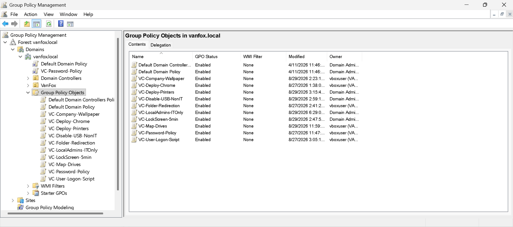

---

## Password and Account-Lockout Policy

The `VC-Password-Policy` GPO is linked at the domain level so that the account-policy settings apply to domain accounts.

| Password setting | Configuration |
|---|---|
| Password history | 24 passwords remembered |
| Maximum password age | 60 days |
| Minimum password age | 1 day |
| Minimum password length | 14 characters |
| Complexity requirements | Enabled |
| Reversible encryption | Disabled |

| Account-lockout setting | Configuration |
|---|---|
| Lockout threshold | 10 invalid logon attempts |
| Lockout duration | 15 minutes |
| Reset lockout counter | 15 minutes |
| Administrator account lockout | Enabled |

These settings strengthen authentication security and reduce the risk of password reuse, weak passwords, and repeated password-guessing attempts.

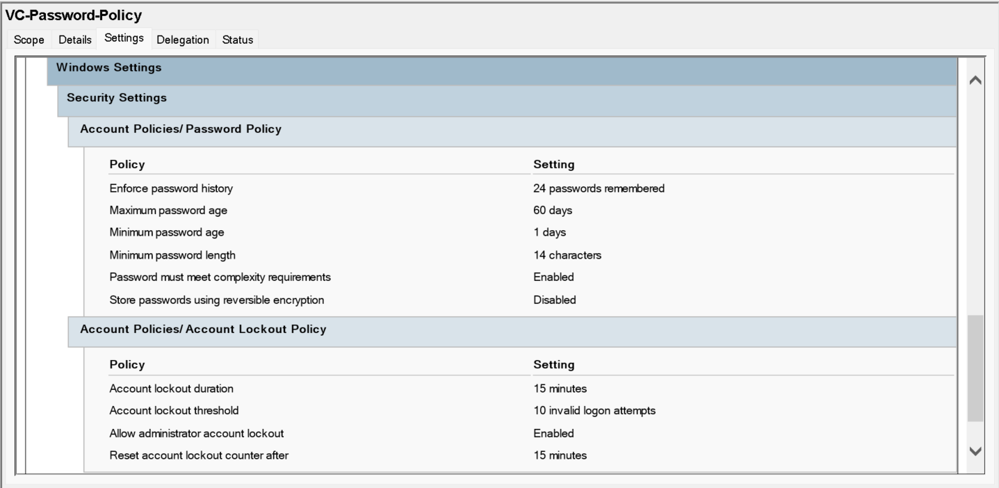

---

## Company Wallpaper

The `VC-Company-Wallpaper` GPO provides a consistent desktop appearance for domain users.

| Setting | Configuration |
|---|---|
| Wallpaper policy | Enabled |
| Wallpaper source | `\\FS01\Public\Branding\VanFox-Wallpaper.png` |
| Wallpaper style | Fit |

The wallpaper is stored centrally on FS01 so it can be maintained without configuring each client computer individually.

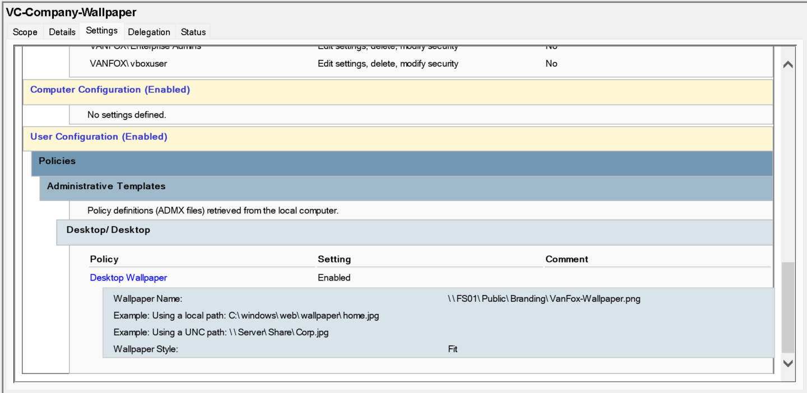

---

## Security-Group-Based Drive Mapping

The `VC-Map-Drives` GPO uses Group Policy Preferences and item-level targeting to map network drives according to Active Directory security-group membership.

### Department Drive

The following example shows the Finance department drive:

| Setting | Configuration |
|---|---|
| Drive letter | `S:` |
| UNC path | `\\FS01\Finance` |
| Label | Finance Department |
| Reconnect | Enabled |
| Target group | `Finance_Share_RW` |

Only users who belong to the required Finance security group receive this drive mapping.

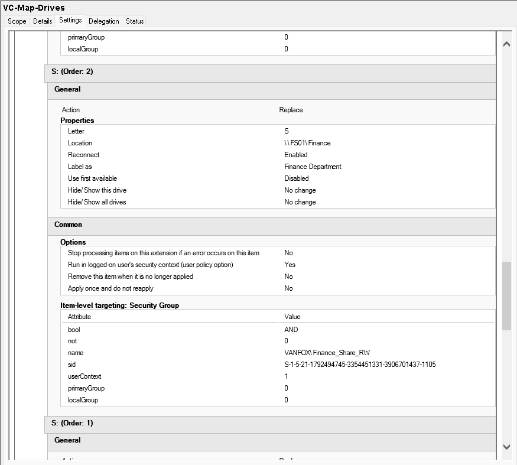

### Public Drive

| Setting | Configuration |
|---|---|
| Drive letter | `P:` |
| UNC path | `\\FS01\Public` |
| Label | Public Share |
| Reconnect | Enabled |
| Target group | `Public_Share_R` |

The preference item is removed automatically when it no longer applies to the user.

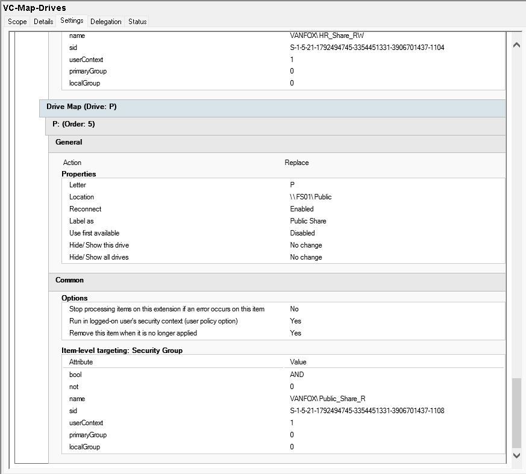

---

## Google Chrome Deployment

The `VC-Deploy-Chrome` GPO assigns Google Chrome to managed domain computers through a centrally stored MSI package.

| Setting | Configuration |
|---|---|
| Application | Google Chrome |
| Architecture | x64 |
| Deployment type | Assigned |
| Package source | `\\FS01\Software$\Chrome\googlechromestandaloneenterprise64.msi` |

Using a UNC package path allows domain computers to locate the installation source through the network.

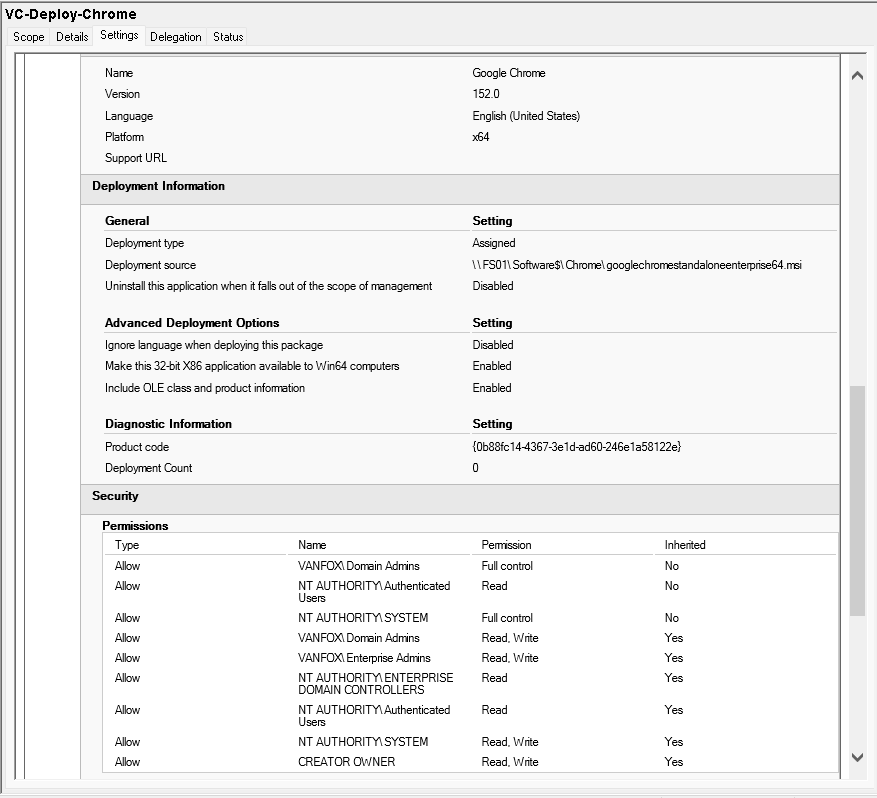

---

## Shared Printer Deployment

The `VC-Deploy-Printers` GPO uses Group Policy Preferences to connect authorized users to the VanFox shared printer.

| Setting | Configuration |
|---|---|
| Shared printer | `\\FS01\VanFox-Printer` |
| Preference action | Update |
| Target group | `Printer_Users` |
| Default printer | No |

Item-level targeting ensures that the printer is deployed only to users who belong to the authorized printer group.

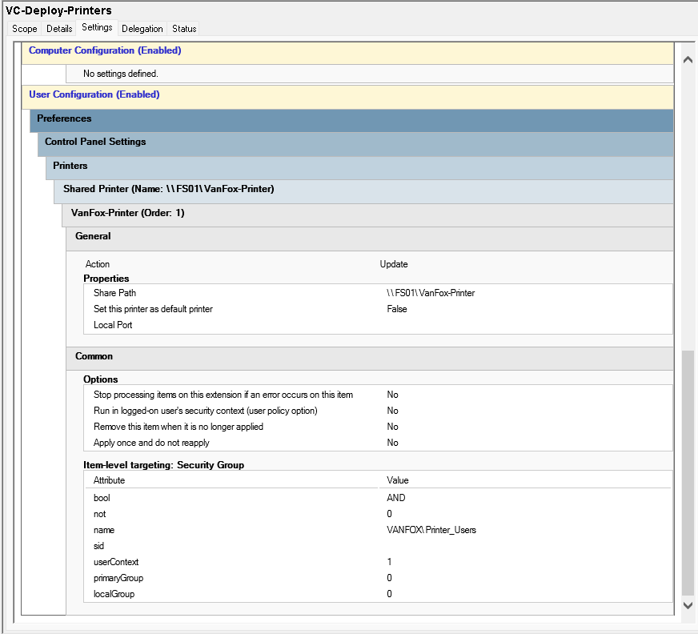

---

## Removable-Storage Restriction

The `VC-Disable-USB-NonIT` GPO blocks access to removable-storage devices for users within the policy scope.

| Setting | Configuration |
|---|---|
| Policy | All Removable Storage classes: Deny all access |
| Status | Enabled |
| Exception group | `USB_Allowed` |

This provides a security control against unauthorized file transfers and removable-media risks.

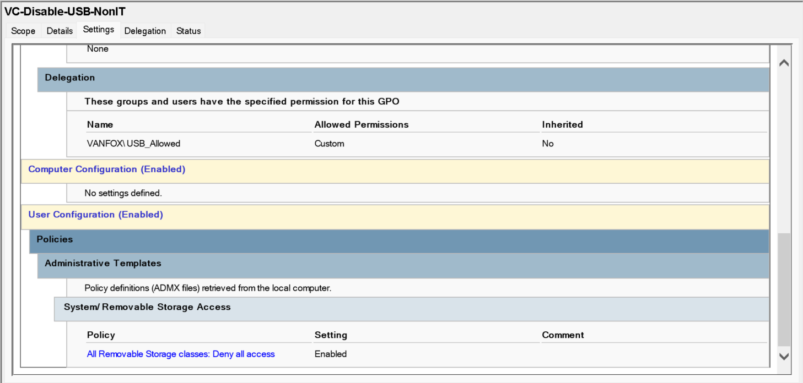

### Authorized USB Exception

Members of `USB_Allowed` retain permission to read the GPO but are explicitly denied the **Apply Group Policy** permission.

Because the restriction GPO does not apply to those users, they can continue using authorized removable-storage devices.

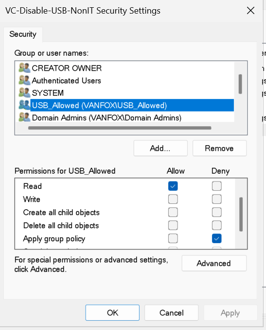

---

## Five-Minute Workstation Lock

The `VC-LockScreen-5min` GPO protects unattended domain workstations.

| Setting | Configuration |
|---|---|
| Enable screen saver | Enabled |
| Screen saver executable | `scrnsave.scr` |
| Password-protect screen saver | Enabled |
| Screen saver timeout | 300 seconds |

After five minutes of inactivity, the screen saver starts and the user must authenticate again to regain access.

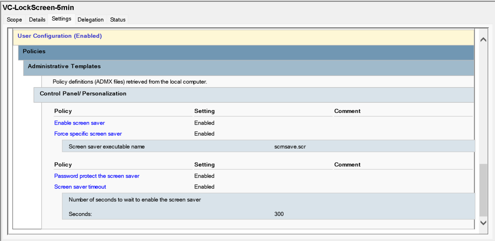

---

## Local Administrator Management

The `VC-LocalAdmins-ITOnly` GPO uses Group Policy Preferences to add the authorized `IT_Admins` domain group to the local Windows Administrators group.

| Setting | Configuration |
|---|---|
| Local group | Administrators |
| Preference action | Update |
| Added domain group | `VANFOX\IT_Admins` |
| Delete existing member users | Disabled |
| Delete existing member groups | Disabled |

This configuration provides administrative access to authorized IT personnel without granting administrator privileges individually to standard users.

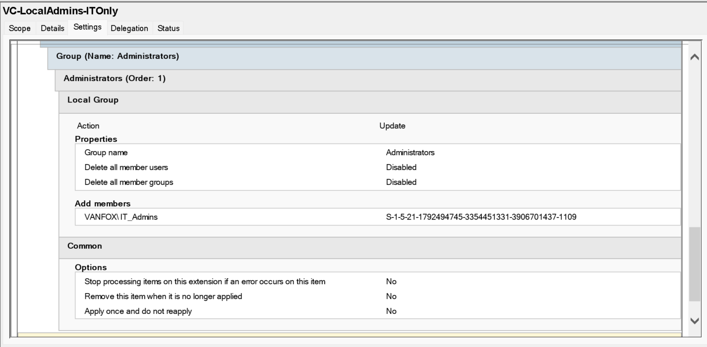

---

## Administrative Approach

The Group Policy design demonstrates several enterprise administration practices:

- Separate GPOs based on administrative purpose
- Domain-level enforcement of account policies
- User and computer configuration through centralized management
- Security-group-based resource assignment
- Group Policy Preferences with item-level targeting
- Centralized UNC paths for files and deployment packages
- Exception handling through GPO security permissions
- Least-privilege local administrator management
- Consistent GPO naming using the `VC-` prefix

---

## Skills Demonstrated

- Group Policy Management Console
- Active Directory security groups
- Password and account-lockout administration
- Group Policy Preferences
- Item-level targeting
- MSI software deployment
- Shared printer deployment
- Network drive mapping
- Removable-storage access control
- GPO security filtering and delegation
- Local administrator management
- UNC path and file-server integration

---

## Validation

These screenshots document the administrative configuration of the VanFox Group Policy environment.

End-user policy application and client-side results are documented separately in:

```text
11-Client-Join-and-Validation
```

---

## Outcome

The VanFox domain now has a centralized Group Policy structure that applies security controls, organizational resources, application deployments, and standardized user settings across domain-joined Windows computers.

The configuration demonstrates practical Windows Server administration and the use of Active Directory Group Policy to manage an enterprise-style client environment.
