# 11 - Client Join and End-to-End Validation

## Overview

This final phase documents the domain membership and end-to-end validation of the two Windows 11 clients in the VanFox Active Directory environment.

The validation confirms that the clients can locate domain services, authenticate domain users, receive Group Policy, access authorized resources, install centrally deployed applications and printers, and enforce security restrictions based on user and group membership.

---

## Objectives

- Confirm both Windows 11 clients exist in Active Directory
- Verify correct computer OU placement
- Confirm membership in the `vanfox.local` domain
- Verify DC01 is used for internal DNS
- Test connectivity to DC01 and FS01
- Confirm expected user GPOs are applied
- Validate mapped drives and company wallpaper
- Confirm Chrome and printer deployment
- Test blocked and authorized USB access
- Verify local administrator group membership
- Confirm the five-minute workstation lock policy

---

## Client Configuration

| Client | IP address | Computer OU | Purpose |
|---|---|---|---|
| `WIN11-01` | `10.0.2.30` | `VanFox\Computers\HR-PCs` | HR-managed Windows client |
| `WIN11-02` | `10.0.2.40` | `VanFox\Computers\IT-PCs` | IT-managed Windows client |

Both computers use the following domain services:

| Service | Configuration |
|---|---|
| Active Directory domain | `vanfox.local` |
| Domain controller | `DC01` |
| DNS server | `10.0.2.15` |
| File server | `FS01` |
| File-server address | `10.0.2.20` |

---

## Active Directory Computer Objects

The following PowerShell query was used on DC01 to verify the Windows client computer objects and their OU placement:

```powershell
Get-ADComputer -Filter 'Name -like "WIN11-*"' -Properties OperatingSystem |
Select-Object Name, OperatingSystem, DistinguishedName |
Format-List
```

The results confirm:

- `WIN11-01` is located in the `HR-PCs` OU
- `WIN11-02` is located in the `IT-PCs` OU
- Both systems are registered as Windows 11 computers

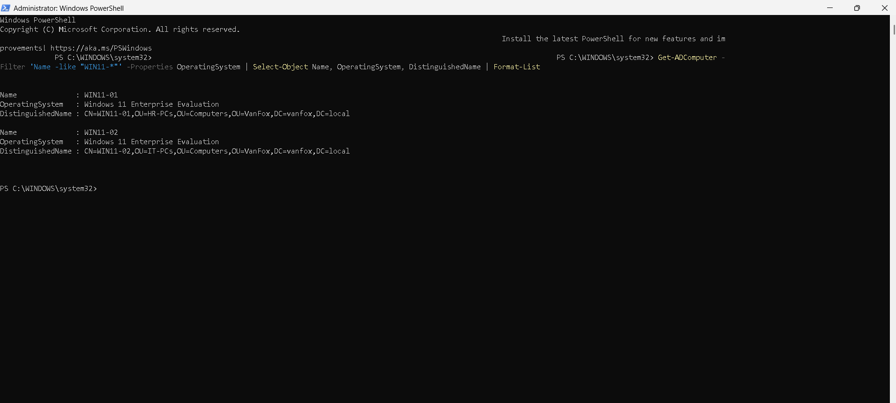

---

## Domain and DNS Validation

The following standard Command Prompt tools were used on both Windows clients:

| Command | Validation purpose |
|---|---|
| `hostname` | Confirms the client computer name |
| `whoami` | Confirms the signed-in domain account |
| `systeminfo` | Confirms membership in `vanfox.local` |
| `ipconfig` | Displays the client IPv4 configuration |
| `ipconfig /all` | Confirms DC01 is the configured DNS server |
| `ping` | Confirms name resolution and connectivity to DC01 and FS01 |

### WIN11-01

The WIN11-01 validation confirmed:

- Hostname: `WIN11-01`
- Domain: `vanfox.local`
- IPv4 address: `10.0.2.30`
- DNS server: `10.0.2.15`
- `dc01.vanfox.local` resolved to `10.0.2.15`
- `fs01.vanfox.local` resolved to `10.0.2.20`
- Both servers responded with zero packet loss

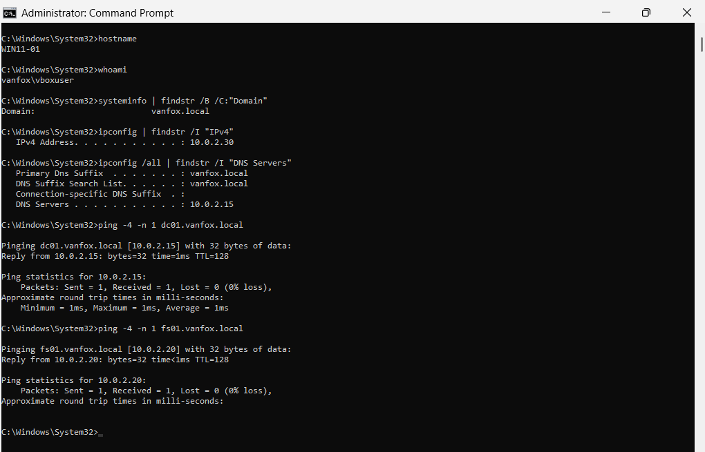

### WIN11-02

The same validation was repeated on WIN11-02.

The results confirmed:

- Hostname: `WIN11-02`
- Domain: `vanfox.local`
- IPv4 address: `10.0.2.40`
- DNS server: `10.0.2.15`
- Successful name resolution and connectivity to DC01 and FS01

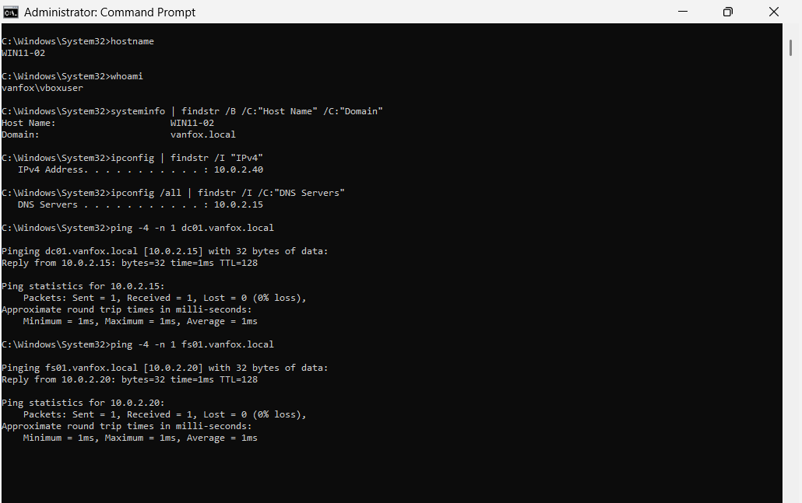

---

## Applied Group Policy Validation

The following commands were used to refresh and inspect the effective user policy:

```cmd
gpupdate /force
gpresult /r /scope:user
```

The validation was performed on WIN11-01 while signed in as the HR user `VANFOX\abrown`.

The output confirmed that the following GPOs applied:

```text
VC-Folder-Redirection
VC-User-Logon-Script
VC-Company-Wallpaper
VC-Map-Drives
VC-LockScreen-5min
VC-Disable-USB-NonIT
VC-Deploy-Printers
```

The result also confirms that Group Policy was received from:

```text
DC01.vanfox.local
```

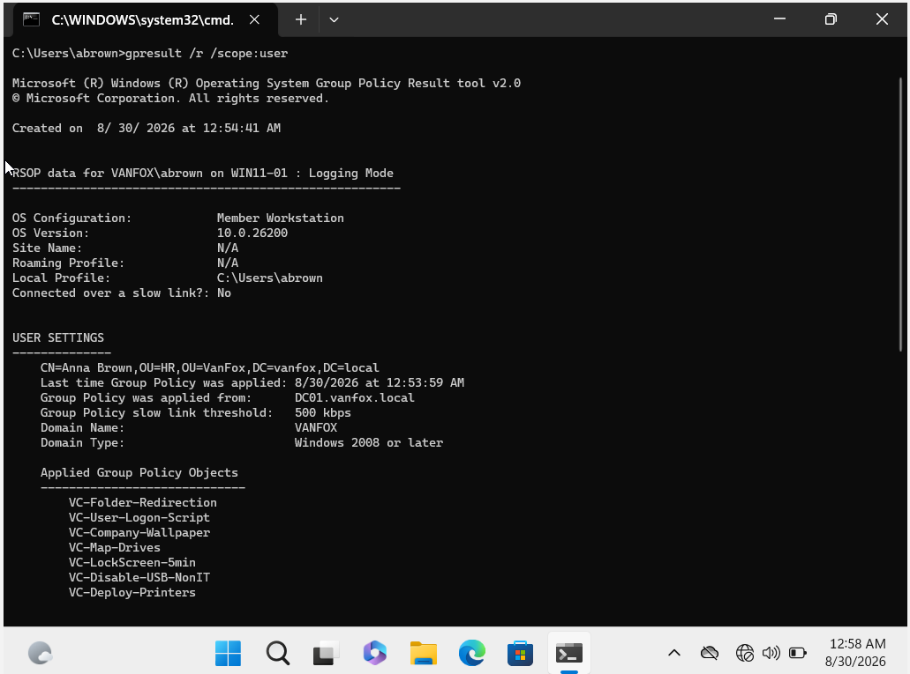

---

## Managed User Environment

The managed user environment was validated on WIN11-02 while signed in as `VANFOX\abrown`.

The following resources appeared automatically:

| Resource | Result |
|---|---|
| Personal Home Folder | `H:` mapped to `\\FS01\Home$\abrown` |
| Public share | `P:` mapped to `\\FS01\Public` |
| HR department share | `S:` mapped to `\\FS01\HR` |
| Company wallpaper | VanFox wallpaper applied |

This demonstrates that the user receives the correct environment even when signing in to another domain-joined computer.

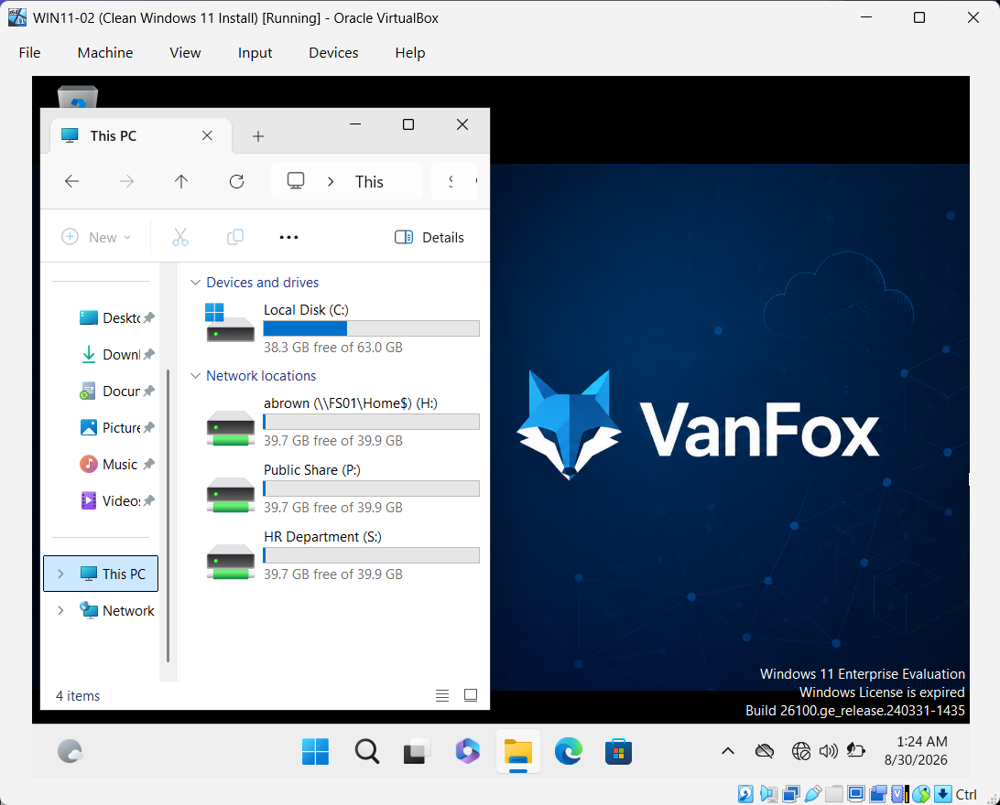

---

## Google Chrome Deployment

Google Chrome was found in **Settings → Apps → Installed apps** on WIN11-02.

The client-side result confirms that the assigned MSI package configured in `VC-Deploy-Chrome` was installed successfully.

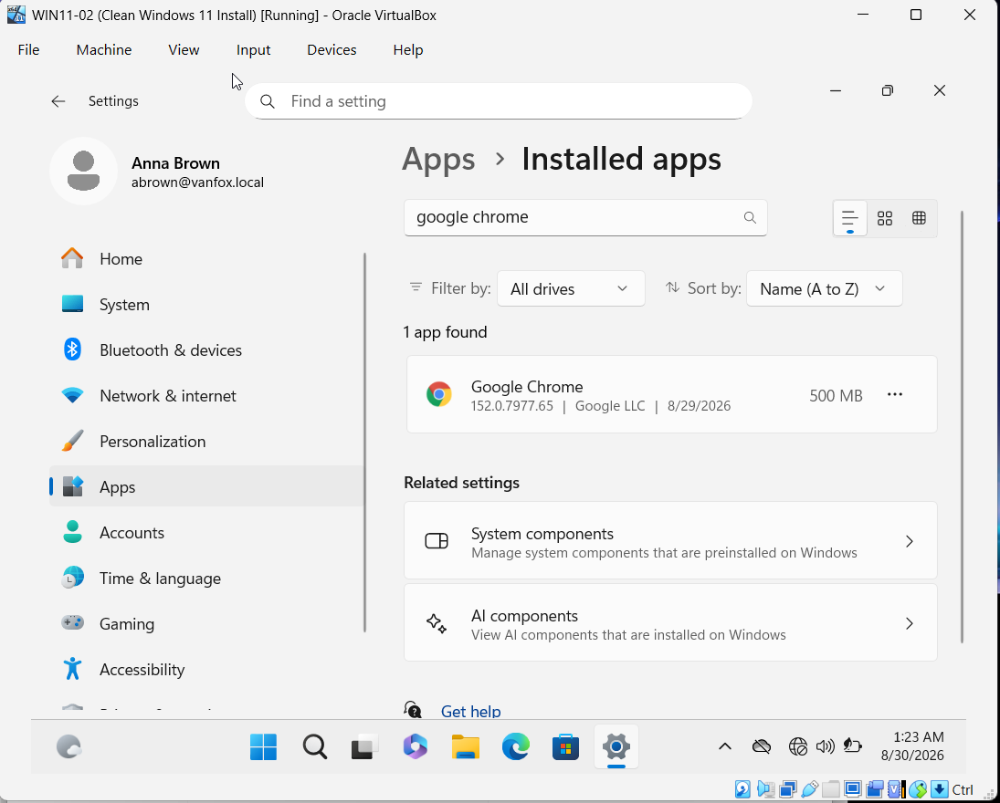

---

## Shared Printer Deployment

The shared VanFox printer appeared in Windows Settings for an authorized domain user.

| Setting | Result |
|---|---|
| Printer | `VanFox-Printer on FS01` |
| Status | Idle |
| Deployment method | Group Policy Preferences |
| Targeting | `Printer_Users` security group |

This confirms that the printer connection was deployed from FS01 to an authorized user on WIN11-02.

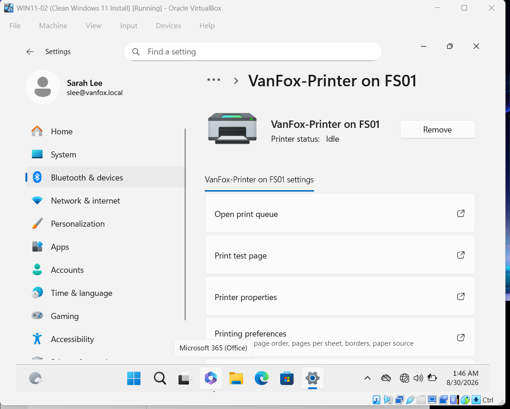

---

## USB Restriction Validation

### Non-IT User Blocked

The physical USB device was attached to WIN11-02 while signed in as the HR user:

```text
VANFOX\abrown
```

Windows detected the removable drive, but attempting to open it returned:

```text
D:\ is not accessible.
Access is denied.
```

This confirms that `VC-Disable-USB-NonIT` successfully blocks removable-storage access for the non-exempt user.

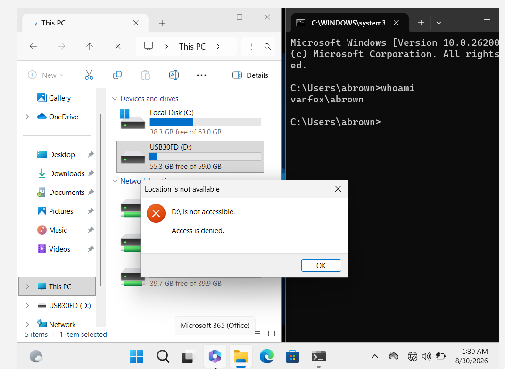

### Authorized User Allowed

The USB test was repeated using:

```text
VANFOX\slee
```

The command below confirmed that the user belongs to the exception group:

```cmd
whoami /groups | findstr /I "USB_Allowed"
```

The USB contents opened successfully because members of `USB_Allowed` are excluded from applying the removable-storage restriction GPO.

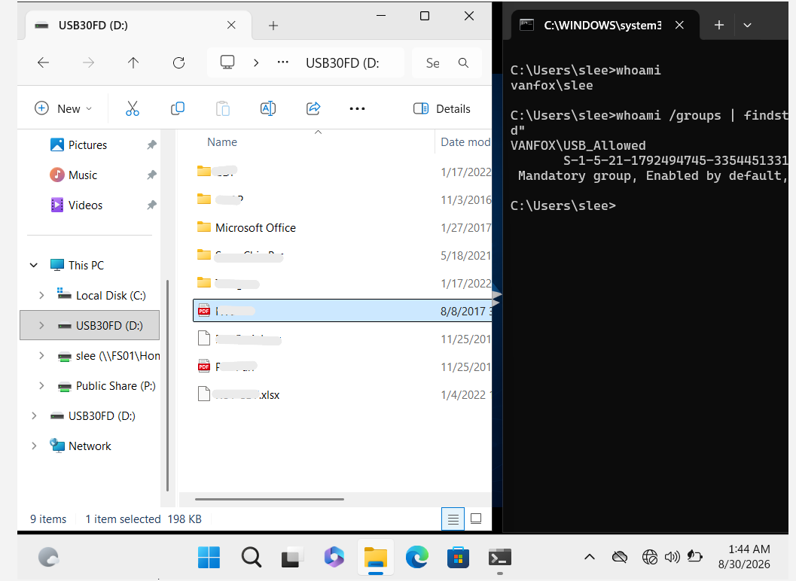

---

## Local Administrator Validation

The local Administrators group was inspected on WIN11-02 using:

```cmd
net localgroup administrators
```

The output confirmed that the following domain group is a member:

```text
VANFOX\IT_Admins
```

This demonstrates centralized administrative access through group membership instead of assigning local administrator privileges separately to individual IT users.

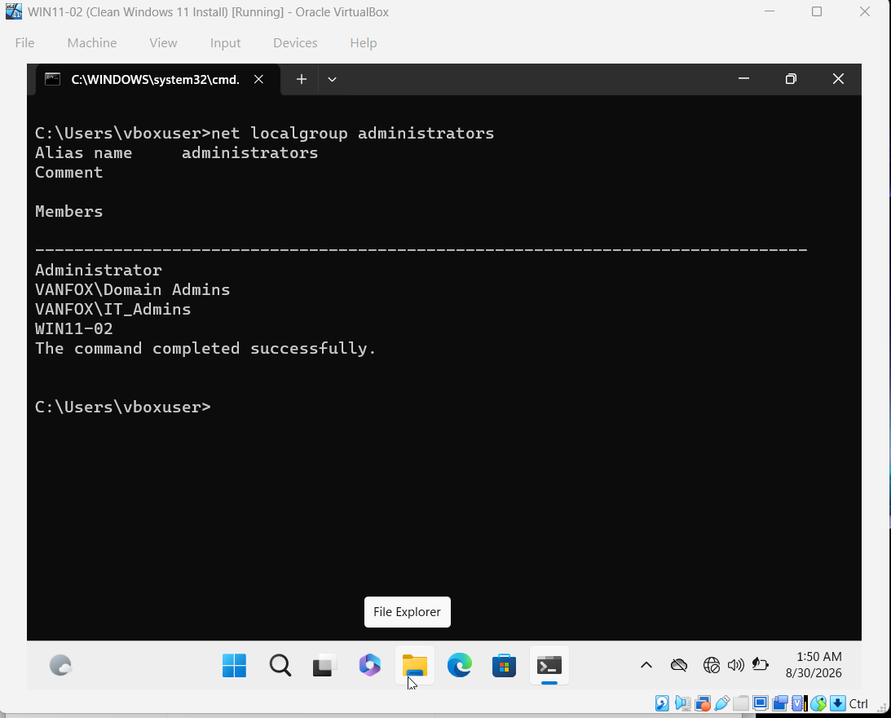

---

## Five-Minute Workstation Lock

The workstation was left inactive while signed in as Anna Brown.

After the configured inactivity period, WIN11-02 returned to the password-protected sign-in screen. This confirms that the `VC-LockScreen-5min` policy was enforced on the client.

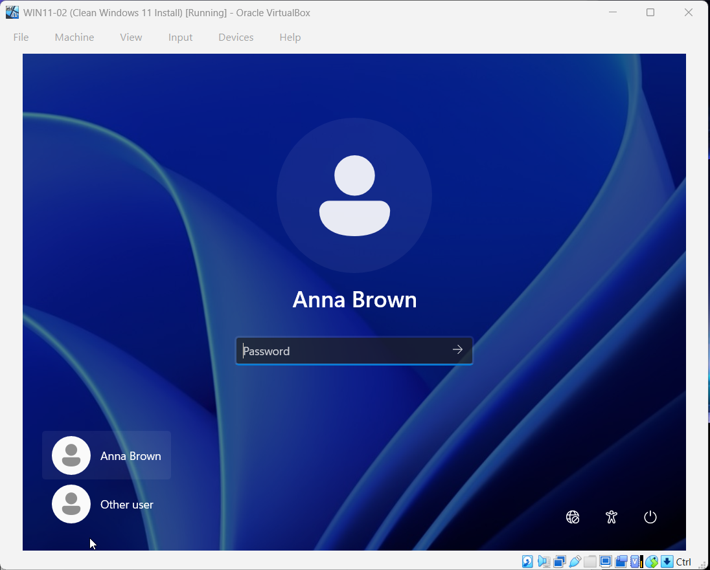

---

## Final Validation Matrix

| Validation test | Expected result | Result | Evidence |
|---|---|---|---|
| Client computer objects | Both clients appear in their assigned OUs | Pass | Screenshot 01 |
| WIN11-01 domain membership | Member of `vanfox.local` | Pass | Screenshot 02 |
| WIN11-02 domain membership | Member of `vanfox.local` | Pass | Screenshot 03 |
| Internal DNS | DC01 and FS01 resolve successfully | Pass | Screenshots 02–03 |
| User Group Policy | Required user GPOs apply from DC01 | Pass | Screenshot 04 |
| Home Folder | H: maps to the signed-in user’s private folder | Pass | [Section 07](../07-Personal-Home-Folders/) |
| Home Folder privacy | Another user receives Access Denied | Pass | [Section 07](../07-Personal-Home-Folders/) |
| Folder Redirection | Documents points to the FS01 redirected location | Pass | [Section 08](../08-Folder-Redirection/) |
| Multi-client user data | The same document appears on both clients | Pass | [Section 08](../08-Folder-Redirection/) |
| Logon script | `LogonInfo.txt` is generated at sign-in | Pass | [Section 09](../09-Logon-Script/) |
| Mapped drives | H:, P:, and the correct S: drive appear | Pass | Screenshot 05 |
| Company wallpaper | VanFox wallpaper applies | Pass | Screenshot 05 |
| Chrome deployment | Google Chrome is installed | Pass | Screenshot 06 |
| Printer deployment | VanFox printer appears for an authorized user | Pass | Screenshot 07 |
| USB restriction | Non-exempt user receives Access Denied | Pass | Screenshot 08 |
| USB exception | `USB_Allowed` user can access the device | Pass | Screenshot 09 |
| Local administrators | `IT_Admins` appears in local Administrators | Pass | Screenshot 10 |
| Five-minute lock | Authentication is required after inactivity | Pass | Screenshot 11 |

---

## Troubleshooting Method

The following order was used when validating or troubleshooting the environment:

1. Confirm the client uses DC01 for DNS.
2. Verify DC01, FS01, and `vanfox.local` resolve internally.
3. Confirm the user and computer objects are in the intended OUs.
4. Check the user’s security-group membership.
5. Run `gpupdate /force`.
6. Use `gpresult /r` to inspect applied and filtered GPOs.
7. Check the mapped resource, application, printer, or restriction directly.
8. Review share and NTFS permissions when access differs from the expected result.
9. Change one configuration variable at a time and repeat the test.

---

## Skills Demonstrated

- Windows 11 domain joining
- Active Directory computer administration
- Computer OU placement
- IPv4 and DNS configuration
- Internal DNS troubleshooting
- Command Prompt validation
- Group Policy refresh and Resultant Set of Policy
- Security-group-based resource deployment
- Network drive validation
- MSI application deployment
- Shared printer deployment
- Removable-storage access control
- GPO security exceptions
- Local administrator management
- Multi-user and multi-client testing
- End-to-end technical documentation

---

## Outcome

Both Windows 11 clients were successfully integrated into the VanFox Active Directory domain and validated against the lab’s identity, networking, file-service, user-data, software-deployment, printer, and security requirements.

The completed validation demonstrates that the environment functions as an integrated enterprise-style Windows domain rather than as a collection of individually configured systems.
