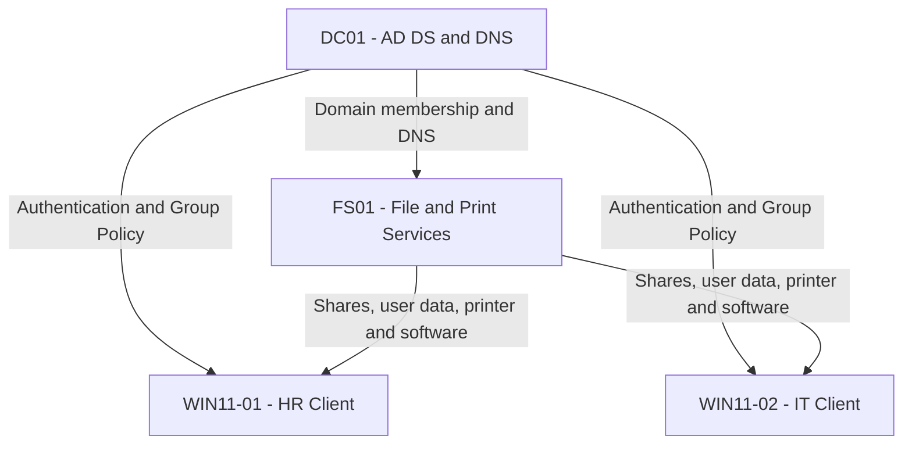

# VanFox Active Directory Lab

> A four-VM, enterprise-style Windows domain lab demonstrating identity administration, centralized storage, Group Policy, endpoint management, security controls, and end-to-end validation.

**Project status:** Complete and validated

---

## Project Summary

The VanFox Active Directory Lab simulates a small business Windows environment using Windows Server 2022, Windows 11, and Oracle VirtualBox.

The project demonstrates the complete lifecycle of a managed Windows domain: infrastructure planning, domain-controller deployment, directory design, user provisioning, file-server administration, Group Policy configuration, domain-client integration, and systematic validation.

The environment includes 20 domain users across five departments, group-based access control, secured department shares, private Home Folders, Documents Folder Redirection, PowerShell logon automation, application and printer deployment, USB restrictions, and managed Windows 11 clients.

---

## Environment at a Glance

| Component | Configuration |
|---|---|
| Virtualization platform | Oracle VirtualBox |
| Domain | `vanfox.local` |
| Virtual machines | 4 |
| Domain users | 20 |
| Business departments | 5 |
| Custom Group Policy Objects | 10 |
| Domain clients | 2 |
| Domain controller and DNS | `DC01` — `10.0.2.15` |
| File and print server | `FS01` — `10.0.2.20` |
| HR client | `WIN11-01` — `10.0.2.30` |
| IT client | `WIN11-02` — `10.0.2.40` |

---

## Architecture

All domain members use DC01 for internal DNS. FS01 provides SMB storage, redirected user data, software packages, and the shared printer.

---

## Core Implementation

### Identity and Directory Services

- Deployed DC01 with Active Directory Domain Services and DNS
- Created the `vanfox.local` forest and domain
- Designed department-based user and computer OUs
- Provisioned 20 domain users across five departments
- Populated standardized department and job-title attributes
- Centralized security groups in `VanFox\_Admin\Groups`

### Access-Control Model

- Assigned permissions through Active Directory security groups
- Separated resource groups from administrative-role groups
- Used department groups for share access
- Used policy groups for Folder Redirection, printer deployment, and USB exceptions
- Applied least-privilege share and NTFS permissions

### File and User-Data Services

- Joined FS01 to the domain
- Provisioned a dedicated NTFS data volume
- Created secured HR, Finance, Operations, and Warehouse shares
- Created a read-only Public share
- Enabled Access-Based Enumeration
- Deployed private user Home Folders as drive `H:`
- Redirected user Documents folders to FS01
- Validated centralized files across both Windows 11 clients

### Group Policy and Endpoint Management

- Enforced password and account-lockout requirements
- Applied the VanFox company wallpaper
- Mapped department and Public drives through item-level targeting
- Deployed Google Chrome through an assigned MSI package
- Deployed the shared VanFox printer
- Restricted removable-storage access for non-exempt users
- Created a controlled `USB_Allowed` exception
- Password-protected inactive workstations after five minutes
- Added `IT_Admins` to the local Administrators group
- Deployed a PowerShell logon script through SYSVOL

---

## Security Design

| Control | Implementation |
|---|---|
| Department access | Department-specific Global Security groups |
| Public resources | `Public_Share_R` with read-only access |
| Private storage | Per-user Home Folder NTFS permissions |
| Redirected Documents | `Folder_Redirection_Users` security filtering |
| Printer access | `Printer_Users` item-level targeting |
| Removable storage | Denied for non-exempt users |
| USB exception | `USB_Allowed` excluded from applying the restriction |
| Local administration | `IT_Admins` added through Group Policy |
| Password security | 14-character minimum, complexity, and 24-password history |
| Account lockout | 10 invalid attempts, 15-minute lockout |
| Workstation inactivity | Password-protected lock after 300 seconds |

---

## End-to-End Validation

The completed environment was validated from both administrative and end-user perspectives.

| Test | Result |
|---|---|
| Both Windows clients registered in Active Directory | Pass |
| WIN11-01 and WIN11-02 joined to `vanfox.local` | Pass |
| DC01 and FS01 resolve through internal DNS | Pass |
| Department and Public drives map correctly | Pass |
| Unauthorized department access is denied | Pass |
| Private Home Folder maps as `H:` | Pass |
| Cross-user Home Folder access is denied | Pass |
| Redirected Documents follows the user between clients | Pass |
| PowerShell logon script creates `LogonInfo.txt` | Pass |
| VanFox wallpaper applies | Pass |
| Google Chrome installs through Group Policy | Pass |
| Shared printer appears for authorized users | Pass |
| Non-exempt user is blocked from USB storage | Pass |
| `USB_Allowed` user can access USB storage | Pass |
| `IT_Admins` appears in local Administrators | Pass |
| Workstation requires authentication after inactivity | Pass |

Detailed client-side evidence is available in [11-Client-Join-and-Validation](./11-Client-Join-and-Validation/).

---

## Project Documentation

| Phase | Documentation | Highlights |
|---:|---|---|
| 01 | [Infrastructure](./01-Infrastructure/) | Four-VM VirtualBox environment and architecture |
| 02 | [Domain Controller Promotion](./02-Domain-Controller-Promotion/) | AD DS, DNS, and `vanfox.local` |
| 03 | [OU Design](./03-OU-Design/) | Departmental users, groups, and computer OUs |
| 04 | [Security Groups](./04-Security-Groups/) | Resource, role, and policy-targeting groups |
| 05 | [User Provisioning](./05-User-Provisioning/) | 20 structured domain-user accounts |
| 06 | [File Server](./06-File-Server/) | FS01, SMB shares, NTFS permissions, and print role |
| 07 | [Personal Home Folders](./07-Personal-Home-Folders/) | Private H: drives and cross-user access denial |
| 08 | [Folder Redirection](./08-Folder-Redirection/) | Centralized Documents and multi-client availability |
| 09 | [Logon Script](./09-Logon-Script/) | PowerShell deployment through SYSVOL and GPO |
| 10 | [Group Policy](./10-Group-Policy/) | Security, resource, software, and endpoint policies |
| 11 | [Client Join and Validation](./11-Client-Join-and-Validation/) | Domain integration and end-to-end testing |

---

## Troubleshooting Approach

The project uses a repeatable troubleshooting order:

1. Confirm that the client uses DC01 for DNS.
2. Verify name resolution and connectivity to DC01 and FS01.
3. Confirm user and computer OU placement.
4. Check security-group membership.
5. Refresh policy with `gpupdate /force`.
6. Inspect effective policy with `gpresult`.
7. Check share and NTFS permissions.
8. Test the feature directly from a domain client.
9. Change one variable at a time and document the result.

Examples encountered during the build included:

- Restoring FS01 DNS resolution after confirming DC01 availability
- Repeating administrative role installation with an authorized account
- Correcting mapped-drive targeting through Group Policy Preferences
- Validating policy application with `gpresult`
- Comparing blocked and authorized USB behavior
- Testing redirected user data across two computers

---

## Skills Demonstrated

- Windows Server 2022 administration
- Active Directory Domain Services
- DNS configuration and troubleshooting
- Organizational Unit design
- User and computer administration
- Security-group-based access control
- Windows file and print services
- SMB share and NTFS permission administration
- Home Folder deployment
- Folder Redirection
- Group Policy Management
- Group Policy Preferences
- Item-level targeting
- MSI software deployment
- PowerShell logon scripting
- Windows 11 domain integration
- Endpoint policy validation
- Command Prompt and PowerShell troubleshooting
- Technical documentation

---

## Portfolio Summary

> Built and documented a four-VM Windows Server Active Directory lab with AD DS, DNS, organizational units, 20 user accounts, role-based security groups, domain-joined Windows 11 clients, secured department shares, private Home Folders, Documents Folder Redirection, PowerShell logon scripting, software and printer deployment, USB restrictions, and end-to-end Group Policy validation.

---

## Author

**Van Neih Thawng**

IT Support | Help Desk | Junior Systems Administration
